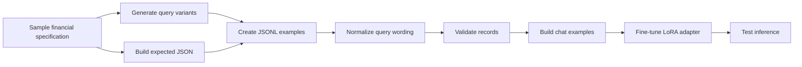
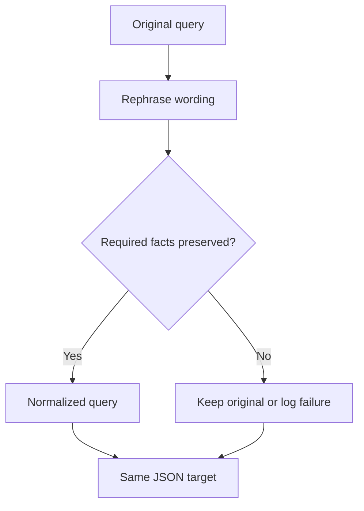
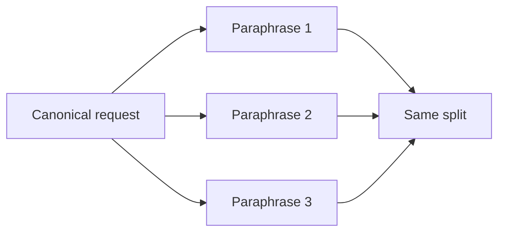
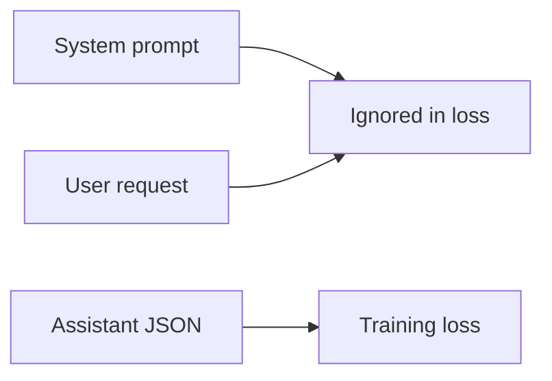

# Report: Fundamentals Tool-Calling Model

## Executive Summary

This report covers only the fundamentals subproject of Agentic Finance. The purpose of this subproject is to build an initial working model that converts natural-language financial fundamentals requests into valid JSON function calls.

The model is trained for a constrained task. It does not answer financial questions directly, calculate values, generate SQL, or perform analysis. Instead, it translates a user request into a structured call to `get_fundamentals`, preserving the requested companies, metrics, and time period.

The subproject includes the complete first version of the model pipeline:

- Synthetic data generation for fundamentals tool-calling examples.
- Query normalization to reduce repetitive wording.
- JSONL validation and dataset preparation.
- Chat-format conversion for instruction-style training.
- LoRA fine-tuning of a compact base model.
- Basic inference testing with the trained adapter.

The result is an initial specialized model that can later be used as one component inside the broader Agentic Finance system.

## Subproject Objective

The fundamentals model solves a translation problem:

```text
natural-language financial request -> structured JSON function call
```

Example user request:

```text
Please show the free cash flow and diluted shares of Amazon from 2018 to 2023.
```

Expected model output:

```json
{
  "action": "call",
  "function": "get_fundamentals",
  "arguments": {
    "queries": [
      {
        "symbols": ["Amazon"],
        "metrics": ["Free Cash Flow", "Diluted Shares"],
        "start_year": 2018,
        "end_year": 2023
      }
    ]
  }
}
```

The output must be valid JSON and must preserve the user's intent. This is especially important when a request contains multiple companies and multiple metrics. If a user asks for one metric for Company A and another metric for Company B, the model must not mix the assignments.

## Pipeline Overview

The subproject follows a staged process:



Each stage has a specific role:

- Sampling creates controlled combinations of companies, metrics, and years.
- Query generation creates natural-language user-style requests.
- Expected-output construction creates the correct JSON target from the same specification.
- JSONL storage keeps each example inspectable and easy to load.
- Normalization improves language diversity.
- Validation prevents malformed examples from entering training.
- Chat formatting matches the model's expected training and inference format.
- LoRA fine-tuning specializes the base model for this constrained function-calling task.

## Data Generation

The data generation process starts from structured specifications. A specification defines:

- Company names.
- Financial metrics.
- A start year.
- An end year.
- In intermediate cases, group-level company-metric assignments.

From each specification, the project creates both the user-facing query and the expected function-call output. This is the main advantage of synthetic generation: the input language can vary while the target output remains deterministic.

### Easy Examples

Easy examples use a simple mapping. One or more companies share the same requested metrics over the same time range.

```text
Companies: [A, B]
Metrics: [Revenue, Free Cash Flow]
Years: 2018-2023

Expected mapping:
A -> Revenue, Free Cash Flow, 2018-2023
B -> Revenue, Free Cash Flow, 2018-2023
```

These examples teach the base behavior:

- Extract company names.
- Extract metric names.
- Extract the year range.
- Produce the correct JSON structure.
- Avoid extra prose around the function call.

### Intermediate Examples

Intermediate examples are more realistic because they use grouped relationships. Different company groups can have different requested metrics while sharing the same year range.

```text
Group 1:
  Companies: [A]
  Metrics: [Diluted Shares]

Group 2:
  Companies: [B, C]
  Metrics: [Revenue, Free Cash Flow]

Years: 2016-2022
```

The expected mapping is:

```text
A -> Diluted Shares
B, C -> Revenue, Free Cash Flow
```

This stage is important because many user requests are compound. A model that simply applies every metric to every company will produce invalid tool calls. Intermediate examples train the model to preserve associations.

## Dataset Format

The dataset is stored as JSONL, with one training example per line. Each record has the same conceptual structure:

| Field | Purpose |
| --- | --- |
| `query` | Natural-language user request. |
| `output_str` | JSON function call as text, used as the training target. |
| `output_json` | Parsed JSON object used for validation and inspection. |
| `metadata` | Trace information about companies, metrics, years, and generation. |

JSONL is practical for this project because it can be appended during generation, inspected line by line, and loaded directly into dataset tooling.

## Query Normalization

The first generated examples are useful, but synthetic query generation can create repeated language patterns. If too many examples use similar phrasing, the model may learn a narrow template instead of learning the actual translation task.

Normalization rephrases selected user queries while preserving the same structured meaning. The JSON target is not changed.



The normalization step requires the core facts to remain intact:

- Company names.
- Metric names.
- Start year.
- End year.
- Company-metric relationships.

This improves the model's robustness to different user wording without changing the supervised target.

## Validation

Validation is a critical stage because function calling is sensitive to small errors. The project validates examples before training to ensure that:

- The query is a non-empty string.
- The output string is valid JSON.
- The parsed output string and the stored JSON object match.
- Metadata has a consistent structure.

This prevents silent dataset issues from becoming training issues. For a normal conversational model, a small text mistake may be tolerable. For a tool-calling model, invalid JSON or a wrong field can break execution.

## Train/Test Split

The project uses grouped splitting to reduce paraphrase leakage. Multiple query phrasings can represent the same underlying request. If one paraphrase appears in training and another appears in testing, evaluation can become misleading.

Grouped splitting keeps related examples in the same split:



This makes evaluation more meaningful because the test set better represents unseen specifications rather than memorized paraphrases.

## Chat Formatting

Each validated example is converted into a chat-style record:

```text
system: You are a financial function-calling model...
user: Natural-language fundamentals request
assistant: JSON function call
```

This format matches the behavior expected from instruction-tuned chat models. The system message defines the task rules, the user message contains the request, and the assistant message contains the expected JSON output.

Using the same format during training and inference reduces mismatch between how the model learns and how it is later used.

## Training Technique

The subproject uses LoRA fine-tuning on a compact base model. This is appropriate because the model already has general language and JSON capabilities. The project only needs to specialize it for a narrow financial function-calling behavior.

LoRA trains small adapter weights rather than updating every base-model parameter. This lowers memory cost, speeds up experimentation, and produces a smaller artifact.

The training setup includes:

- A compact base model.
- LoRA adapters on selected attention projection modules.
- A maximum sequence length of 384 tokens.
- Prompt-token masking.
- Evaluation during training.
- Loss plotting for inspection.

Prompt-token masking is especially important. The system prompt and user query are provided as context, but the loss is applied only to the assistant JSON output.



This teaches the model the intended behavior: given the prompt and user request, generate the structured tool call.

## Inference

During inference, the trained adapter is loaded with the tokenizer. A user request is wrapped with the same system prompt and chat template used during training. The model then generates the assistant completion.

Expected behavior:

- Output one valid JSON object.
- Use the `get_fundamentals` function.
- Preserve company names.
- Preserve requested metrics.
- Preserve start and end years.
- Preserve company-metric assignments.
- Avoid analysis, calculation, SQL, or explanatory text.

Basic inference tests are included for relevant fundamentals requests and irrelevant prompts. Irrelevant prompts are useful as a sanity check, but robust routing and rejection should be handled more formally by the larger system.

## Current Results

The fundamentals subproject currently includes:

- Generated easy examples.
- Generated intermediate examples.
- Normalized query examples.
- A combined JSONL dataset.
- A Hugging Face compatible dataset representation.
- A trained LoRA adapter.
- A basic inference workflow.

The combined dataset contains several thousand examples. The training run completed multiple epochs and selected a best checkpoint based on evaluation loss. This indicates that the subproject has reached an initial working state rather than remaining only a design proposal.

## Limitations

The current fundamentals model is still an early version. Its main limitations are:

- It supports one function rather than a complete financial tool catalog.
- Evaluation is still mostly based on loss and manual inference checks.
- Inference does not yet include a strict schema-validation and retry layer.
- The data distribution is mainly synthetic and should be expanded with real user-style queries.
- Ambiguous companies, aliases, missing years, and unsupported metrics need stronger handling.
- Irrelevant requests need a clearer reject-or-route policy outside the model.

These limitations do not invalidate the current work. They define the next engineering steps for making the fundamentals model more reliable.

## Conclusion

The fundamentals subproject establishes a working procedure for creating a specialized financial tool-calling model. The main contribution is the pipeline: controlled data generation, normalization, JSON validation, chat formatting, LoRA fine-tuning, and inference testing.

This model can become one callable component in the larger Agentic Finance architecture. Its responsibility is intentionally narrow: translate fundamentals requests into valid structured calls. Keeping this boundary clear makes the model easier to evaluate, improve, and integrate.
