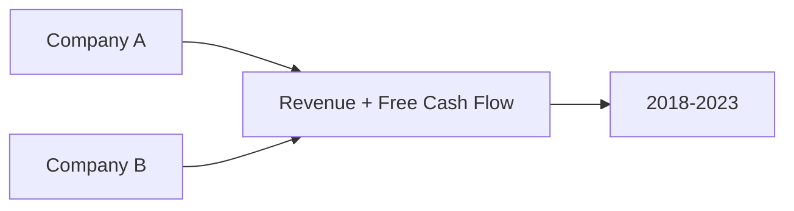
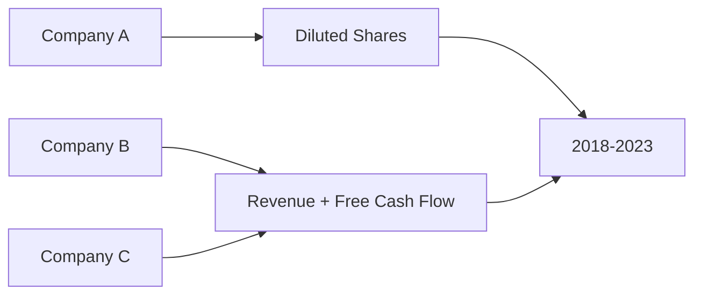
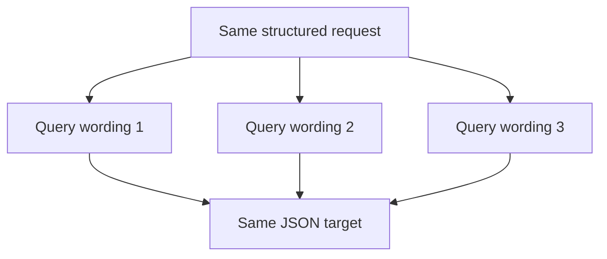
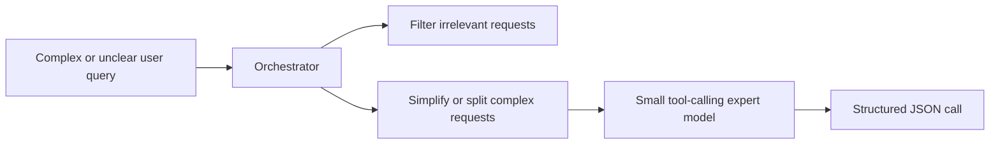
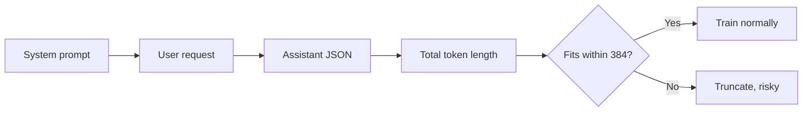
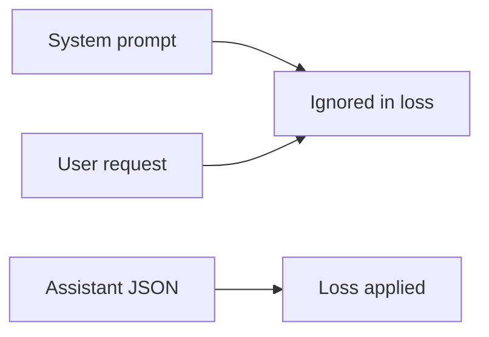
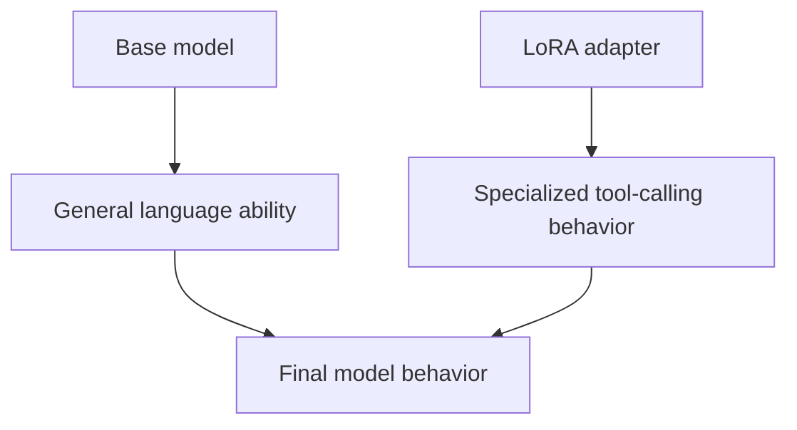
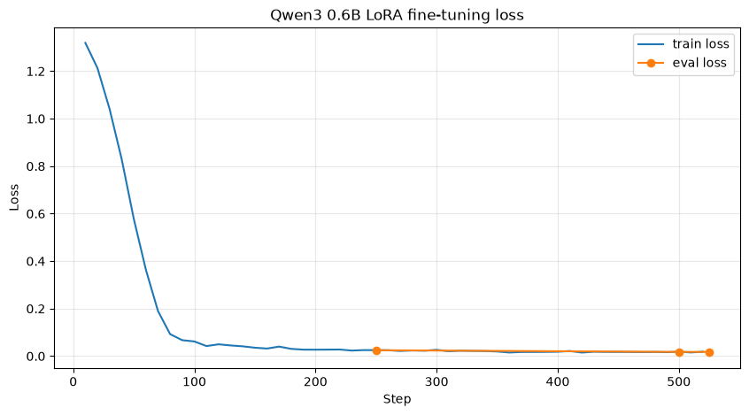
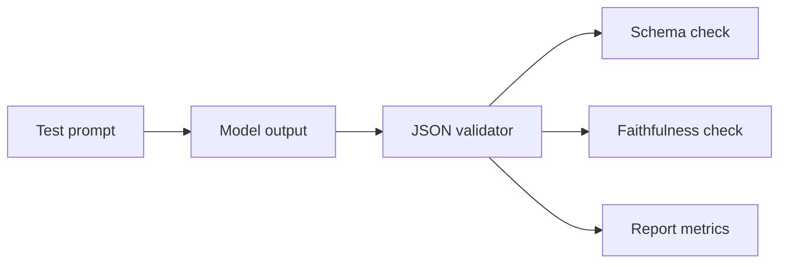

# Technical Notes: Data Generation, Training, Inference, and Hardware

## Purpose

These notes explain the technical choices behind the current tool-calling model. The goal is not only to list parameters, but to explain why the choices matter and how they affect the behavior of the system.

The model is trained for one task:

```text
user financial request -> JSON function call for fundamentals data
```

This is a constrained generation problem. The output must be valid JSON, must call the correct function, and must preserve the user's requested companies, metrics, and years.

## 1. Data Generation Variables

Data generation controls what the model learns. If the generated data is too narrow, the model learns a narrow template. If the generated data is too noisy, the model learns unstable behavior.

### Core Variables

| Variable | Intuition | Effect |
| --- | --- | --- |
| Companies | The entities the model must recognize. | Expands name coverage and improves entity extraction. |
| Metrics | The financial fields requested by the user. | Teaches valid tool arguments. |
| Start and end years | The time range for retrieval. | Teaches temporal extraction. |
| Number of companies | Single or multi-company requests. | Increases structural complexity. |
| Number of metrics | Single or multi-metric requests. | Increases argument complexity. |
| Grouping | Whether metrics belong to all companies or only specific groups. | Teaches association preservation. |
| Query variants | Different natural-language phrasings for the same target. | Improves robustness to user wording. |

### Easy vs Intermediate Data

Easy data has a simple mapping:



Intermediate data has grouped mappings:



The intermediate case is more important for real agentic behavior because users often combine multiple requests in one sentence. The model must learn that not every metric applies to every company.

### Why Store Metadata?

Metadata is not mainly for training the model. It is for control, debugging, and validation.

Metadata answers questions such as:

- Which companies should appear?
- Which metrics should appear?
- Which years are required?
- Which generation iteration created the example?
- Is this example a paraphrase of another example?

Without metadata, it is difficult to know whether a generated query is faithful to the target.

### Data Source and Financial Coverage

The financial data used for this project was fetched from Alpha Vantage and then preprocessed before being used in the dataset pipeline. The current data coverage includes around 140 stocks from the S&P 500 and covers the period from 2009 to 2025.

In addition to the raw fundamentals fields, a reduced-form discounted cash flow calculation was added to estimate intrinsic value. This makes the dataset more useful for downstream financial workflows because the model can be connected not only to reported fundamentals, but also to derived valuation features.

The dataset can be made available subject to the relevant copyright and data-provider constraints.

## 2. Why JSONL?

JSONL means one JSON object per line. It is useful for this project because each line is one independent training example.

```text
line 1 -> example 1
line 2 -> example 2
line 3 -> example 3
```

Advantages:

- Easy to append during generation.
- Easy to resume after partial generation.
- Easy to inspect manually.
- Easy to load with dataset libraries.
- Works well for large datasets because the whole file does not need to be parsed as one giant JSON array.

For this project, JSONL is also a natural bridge between generation, normalization, validation, and training.

## 3. Why Normalize the Data?

A model can overfit to repeated phrasing. If many examples begin with the same sentence pattern, the model may learn the pattern rather than the task.

Normalization creates more variation:



The target JSON does not change. Only the user wording changes.

This teaches the model that many surface forms can mean the same function call. That is important because real users will not all write in the same style.

## 4. Why Use a System Prompt?

The system prompt defines the model's role and rules. In this project, it tells the model that it is a financial function-calling model and that it must output only valid JSON.

The system prompt is useful because it separates general conversation behavior from task behavior.

```text
System prompt: rules and role
User message: request
Assistant message: structured output
```

Without the system prompt, the model may answer like a normal assistant:

```text
Amazon's free cash flow from 2018 to 2023 is...
```

But the desired behavior is:

```json
{"action":"call","function":"get_fundamentals","arguments":{...}}
```

The system prompt teaches the model:

- Do not answer the financial question.
- Do not invent values.
- Do not generate SQL.
- Preserve company-metric relationships.
- Output only JSON.

In the larger agentic system, the orchestrator will decide when this system prompt and this model are appropriate.

## 5. Why JSON for Function Calling?

JSON is used because function calls need structure. A downstream tool cannot reliably execute a vague sentence. It needs explicit fields.

Natural language:

```text
Get revenue for Apple from 2018 to 2023.
```

Structured JSON:

```json
{
  "action": "call",
  "function": "get_fundamentals",
  "arguments": {
    "queries": [
      {
        "symbols": ["Apple"],
        "metrics": ["Revenue"],
        "start_year": 2018,
        "end_year": 2023
      }
    ]
  }
}
```

The JSON format gives the system:

- A clear function name.
- Explicit arguments.
- A predictable structure for execution.
- A format that can be validated before tool use.
- A clean boundary between language understanding and tool execution.

This is central to agentic systems. The model should not directly perform every task. It should produce the right structured command so the right tool can do the task.

## 6. Why Qwen3 0.6B Was Chosen

Qwen3 0.6B was chosen because it is already a compact model with useful tool-calling behavior. Its small size makes it practical for local experimentation, LoRA fine-tuning, and repeated training runs under hardware constraints.

The model also already supports tool-calling style interaction and has a native tool-calling schema. In this project, however, the goal was to show that a custom financial tool-calling schema can be learned as well. The model is therefore not used only because it has built-in tool-calling support, but because it is a strong base for teaching a specific structured output format:

```text
user financial request -> custom get_fundamentals JSON call
```

Qwen3 also has thinking and reasoning capabilities. That ability could be useful in the future for enriching the dataset with more complex and advanced queries. It was not used as the main behavior in the current version because the intended architecture separates complex-query handling from narrow tool-call generation.

The preferred design is:



This separation matters because tool calling and complex-query reasoning are related but not identical tasks. Tool calling requires faithful extraction into a strict schema. Complex-query handling requires filtering, decomposition, routing, and sometimes clarification. It is better to have two small focused components than one model trying to solve both problems at once.

## 7. Why Tokenization Is Needed

Language models do not directly read words or characters as humans do. They read token IDs. A tokenizer converts text into tokens, and tokens into integers.


For example, a sentence and a JSON object are both converted into token sequences. The model learns patterns over those token sequences.

Tokenization matters because:

- It determines how long an example is.
- It affects memory usage.
- It affects truncation.
- It affects the exact chat format seen by the model.
- It controls how the assistant output is represented during training.

The project uses the model's own chat template through the tokenizer. This is important because each chat model expects messages to be formatted in a specific way.

### Why Use `apply_chat_template`?

The training code uses `apply_chat_template` because each chat model has its own expected message format. Qwen's tokenizer knows how Qwen expects system, user, and assistant messages to be represented.

Using the native Qwen tokenizer and chat template reduces the risk of training the model on a format that does not match inference. This is especially important for tool calling because small formatting differences can affect whether the model learns to start the assistant response correctly and produce only the target JSON.

## 8. Why Use a Maximum Length of 384 Tokens?

The maximum sequence length controls how many tokens the model sees for one training example. In this project, examples contain:

- A system prompt.
- A user request.
- An assistant JSON output.

The value `384` is a practical balance:

```text
Too short:
  examples may be truncated
  JSON output may be cut
  training signal becomes broken

Too long:
  more memory is used
  training becomes slower
  small examples waste padding

Chosen balance:
  long enough for current prompts and JSON
  short enough for efficient LoRA fine-tuning
```

Conceptually:



The current task has relatively compact outputs. A very large context window is not necessary because the model is not reading long documents. It is translating short requests into structured calls.

The value was also selected empirically. The Qwen3 0.6B tokenizer was used to compute the token count of each datapoint after formatting. The average example length was around 240 tokens, and the maximum observed length was around 317 tokens. A maximum length of 384 tokens therefore gives enough room for the current examples while avoiding unnecessary padding and memory usage.

If future tools require longer inputs, larger schemas, or multi-turn context, this value may need to increase.

## 9. Why Mask Prompt Tokens?

During training, the full text contains the system prompt, user request, and assistant answer. But the model should learn to generate the assistant answer, not simply copy the prompt.

Prompt masking sets the labels for prompt tokens to `-100`, which tells the trainer to ignore them in the loss calculation.



This makes the training objective more precise:

```text
Given the system prompt and user request, generate the JSON tool call.
```

Without masking, part of the loss would be spent learning to reproduce the input text, which is not the behavior needed at inference time.

## 10. Why LoRA?

LoRA stands for Low-Rank Adaptation. It fine-tunes a small number of additional adapter parameters instead of updating all model weights.

This is useful because the project is not trying to teach the model language from scratch. The base model already knows language, syntax, and JSON-like text. The project only needs to specialize it for a narrow function-calling behavior.



Benefits:

- Lower memory requirements.
- Faster experiments.
- Smaller saved artifact.
- Easier to create multiple adapters for multiple tools later.

The current adapter targets selected attention projection modules. This is a common efficient choice because attention layers are important for mapping relationships between user tokens, company names, metrics, and output fields.

In the current training run, only the query and value projection modules were trained: `q_proj` and `v_proj`. This choice was made mainly because of hardware constraints. These two matrices directly affect how the model forms attention queries and retrieves value information, so they are a reasonable first target for a schema-learning task where the model must map entities, metrics, and years from the prompt into the correct JSON fields.

The LoRA rank was `r=8`, with `lora_alpha=32`, `lora_dropout=0.0`, and `bias="none"`. With PEFT, the effective LoRA scaling factor is `lora_alpha / r`, so this configuration uses a scaling factor of `4`. Rank 8 is a conservative low-rank choice: it gives the adapter enough capacity to learn the custom `get_fundamentals` schema while keeping the number of trainable parameters small. The run trained 1,146,880 parameters out of 597,196,800 total parameters, or about 0.192% of the model.

This means the current model should be understood as an efficient first training run, not the maximum possible version. With stronger hardware or more training time, the adapter could be trained more deeply by targeting additional projection modules such as key, output, gate, up, or down projections, or by increasing the rank. The tradeoff is straightforward: higher rank and more target modules increase adaptation capacity, but also increase memory use, optimizer state, training time, and overfitting risk on a small dataset.

## 11. Important Training Variables

| Variable | Current role | Intuition |
| --- | --- | --- |
| Base model | Compact Qwen model | Small enough for practical experiments, capable enough for structured generation. |
| LoRA rank | Adapter capacity | Higher rank gives more adaptation capacity, but uses more memory. |
| LoRA alpha | Adapter scaling | Controls the strength of the LoRA update. |
| LoRA dropout | Regularization | Dropout can reduce overfitting, but zero dropout keeps behavior direct for this small structured task. |
| Learning rate | Update size | Too high can destabilize JSON behavior; too low may learn slowly. |
| Epochs | Passes over data | More epochs can improve fitting but may increase overfitting. |
| Batch size | Examples per device step | Larger batches are steadier but use more memory. |
| Gradient accumulation | Effective batch increase | Simulates larger batches without requiring all examples in memory at once. |
| Warmup steps | Gradual start | Helps avoid unstable early updates. |
| Weight decay | Regularization | Helps prevent overly sharp memorization. |
| Evaluation steps | Monitoring interval | Allows checking whether loss improves during training. |

### Training Process and Loss Behavior

The training run used 2,788 training examples and 310 test examples. It fine-tuned `Qwen/Qwen3-0.6B` for 3 epochs with LoRA adapters on `q_proj` and `v_proj`. The recorded run completed 525 optimizer steps and took 19,505 seconds, or about 5.4 hours. The notebook output shows that CUDA was not available for that run, so the model used `torch.float32`; this explains the slow throughput of about 0.429 training samples per second and 0.027 training steps per second.

The main training variables were:

| Variable | Value | Engineering meaning |
| --- | --- | --- |
| Base model | `Qwen/Qwen3-0.6B` | Compact tool-capable base model. |
| Train/test examples | 2,788 / 310 | Small controlled dataset, with a held-out split for eval loss. |
| Epochs | 3 | Enough passes to fit the schema without making the first run too expensive. |
| Optimizer steps | 525 | Total parameter-update steps after gradient accumulation. |
| Max sequence length | 384 | Covers the observed max formatted length while avoiding excessive padding. |
| Per-device train batch | 8 | Batch loaded per training step. |
| Gradient accumulation | 2 | Effective batch size of 16 examples before each optimizer update. |
| Learning rate | `1e-4` | Moderate LoRA learning rate for adapting a small number of parameters. |
| Scheduler | cosine | Decays the learning rate after warmup. |
| Warmup steps | 243 | About 46% of total steps, a conservative warmup for stable early training. |
| Weight decay | 0.01 | Regularization on trainable adapter weights. |
| Eval/save interval | 250 steps | Evaluation and checkpointing happen during training, not only at the end. |
| LoRA rank / alpha | `r=8`, `alpha=32` | Low-rank adapter with scaling factor `alpha / r = 4`. |
| LoRA dropout | 0.0 | No adapter dropout; useful for a small deterministic schema task. |
| Trainable parameters | 1,146,880 | About 0.192% of the 597,196,800 total parameters. |

The loss curve shows a fast initial fit followed by a low-loss plateau. Logged training loss dropped from about 1.319 at step 10 to 0.363 at step 60, 0.0618 at step 100, and about 0.0251 at step 250. Later training made smaller improvements: the logged training loss was about 0.0187 at step 500 and 0.0183 at step 520. The final reported `train_loss` metric was 0.1292, which is the averaged training loss over the run, not the last logged batch loss.

Evaluation loss followed the same direction. It was 0.0248 at step 250, improved to 0.0177 at step 500, and stayed essentially flat at 0.0177 at the final step 525. The best checkpoint was selected at step 500 with `eval_loss = 0.017704`, which suggests that the model had already learned most of the available schema signal by the end of the second-to-third epoch region.



Because prompt tokens were masked, these losses focus on the assistant JSON output rather than reproduction of the system and user messages. The curve is therefore meaningful for structured-output fitting: it shows that the adapter quickly learned the high-frequency JSON syntax and schema tokens. However, low loss is still not sufficient evidence of tool-calling correctness. The model can have low token-level loss and still fail on exact company-metric associations, irrelevant queries, out-of-distribution company counts, or malformed edge cases. For this project, the loss curve should be treated as an optimization diagnostic and combined with JSON validity, schema validity, and faithfulness evaluation.

## 12. Inference Variables

Inference uses the trained adapter to generate output for a new user request.

Important variables:

| Variable | Intuition |
| --- | --- |
| System prompt | Keeps the model in function-calling mode. |
| Chat template | Formats the input in the same style used during training. |
| `max_new_tokens` | Limits how long the generated JSON can be. |
| Temperature | Controls randomness. Lower values are usually better for structured JSON. |
| `top_p` / `top_k` | Control the candidate token set during sampling. |
| Device map | Places model weights on available hardware. |

For function calling, deterministic behavior is usually preferred. Creative variation is useful during data generation, but inference should favor valid, stable JSON.

```text
Data generation:
  some diversity is useful

Inference:
  structure and correctness are more important
```

## 13. Hardware Considerations

Hardware affects which model size can be used, how fast training runs, and which precision is practical.

The current approach uses a compact model and LoRA because that combination is hardware efficient.

### CPU vs GPU

| Hardware | Practical impact |
| --- | --- |
| CPU only | Possible for small tests, but training is slow. |
| GPU with fp16 | Faster training and lower memory than fp32. |
| GPU with bf16 | Often more stable if supported. |
| Multiple GPUs | Useful for larger models or larger batches. |

### Memory Drivers

The main memory drivers are:

- Base model size.
- Sequence length.
- Batch size.
- Gradient checkpointing.
- Precision type.
- Optimizer state.
- Whether full fine-tuning or LoRA is used.

A useful intuition:

```text
Memory cost grows with:
model size x sequence length x batch size
```

LoRA reduces the training memory cost because most base model weights remain frozen.

### Why Gradient Checkpointing?

Gradient checkpointing trades compute for memory. Instead of storing every intermediate activation during the forward pass, some activations are recomputed during backpropagation.

This is useful when memory is limited:

```text
Less memory used
More computation required
Training may be slower
```

For small models it may not always be necessary, but it is a useful technique as model size or sequence length increases.

## 14. Current Limitations and Next Options

At this stage, the model still has important limitations. Some of them are general limitations of a first fine-tuned model, but two limitations are especially important:

- The model cannot reliably handle irrelevant queries.
- The model cannot reliably extract metrics for more than three companies or for complex queries.

There are two main ways to improve this:

| Option | Description | Tradeoff |
| --- | --- | --- |
| Enrich the dataset | Generate irrelevant queries, rejection examples, advanced queries, and more complex company-metric groupings. | Improves the specialized model directly, but increases dataset and training complexity. |
| Add an orchestrator | Use a separate orchestrator to filter irrelevant queries and transform complex requests into easy or intermediate requests. | Keeps the tool-calling model focused, but requires an additional routing and decomposition layer. |

The second option matches the larger project architecture. The tool-calling model remains a small expert that converts clear financial requests into JSON. The orchestrator handles filtering, routing, decomposition, and simplification before the request reaches the model.

## 15. Evaluation Direction

Loss is useful, but it is not enough for tool calling. A model can have low loss and still sometimes produce invalid JSON or mix metrics between companies.

Future evaluation should include:

- Valid JSON rate.
- Correct function name rate.
- Exact company preservation.
- Exact metric preservation.
- Exact year preservation.
- Company-metric association accuracy.
- No-extra-text rate.
- Irrelevant-query rejection or routing accuracy.

The strongest evaluation should execute a structured validator against generated outputs.



## 16. Practical Design Intuition

The project's technical decisions follow one principle:

```text
Make the model solve the smallest reliable task,
and let the orchestrator manage the larger conversation.
```

That is why the output is JSON, the prompt is strict, the dataset is controlled, and the training target is masked. The model is not being trained to be a general financial analyst. It is being trained to become a dependable translation component inside an agentic system.

