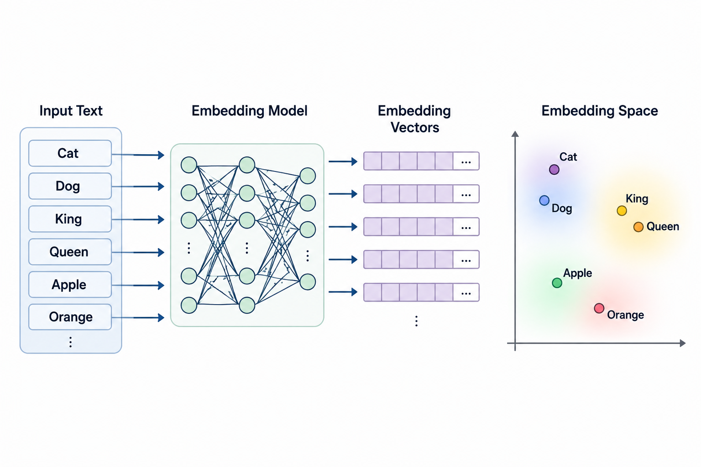
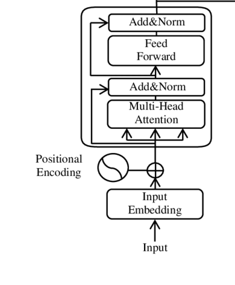

In this article, we explore positional embeddings in Transformer architectures, with a focus on the original sinusoidal positional encoding and the geometric structure it induces. Before diving into the positional aspect, however, we need to understand the foundational concept of modern **embeddings**.

## 0. Prerequisites

This article assumes familiarity with the following concepts:

* **Basic linear algebra**: vectors, dot products, norms, and distances.
* **Basic trigonometry**: sine and cosine functions.
* **Transformer attention**: a high-level understanding that attention allows tokens to interact with one another.

No prior knowledge of positional embeddings, tokenization and Transformers Architecture is required.

Throughout this article, the word **token** is used frequently. A token is a discrete unit of information processed by a model. In domain of language models, a token usually represents a word, part of a word, a punctuation mark, or another piece of text. In other domains, however, tokens may represent image patches, audio segments, time-series windows, and so on.

Before a model can process an input, it must first convert it into a sequence of tokens. The tokens themselves are not directly understood by the neural network. Instead, each token is mapped to a unique integer called a **token ID**. These token IDs are then transformed into vectors through an **embedding layer**, producing numerical representations that the model can process.

As a result, the pipeline looks as follows:

Input → Tokens → Token IDs → Embeddings (Vectors)

The process of converting an input into tokens is called **tokenization**, while the process of converting token IDs into vectors is called **embedding**.

#### Why do we need Token IDs after Tokenization?
While splitting a sentence into string tokens like `["deep", "learning"]` makes sense to humans, neural networks cannot perform mathematical operations on raw text. They operate strictly on matrices and vectors of floating-point numbers. 

Token IDs act as the bridge. By mapping every unique token in a vocabulary to a fixed, unique integer (e.g., `"deep"` $\rightarrow$ `2534`), we create a structured lookup index that the network can process mathematically.

### 0.1. Embeddings

Every piece of text we input into a model needs to be translated into a language the machine can process, and computers only understand numbers. An **embedding model** is a tool that translates human language (like words, sentences, images, etc.) into a structured set of numbers called a vector.

What is the purpose of an embedding?
Categorization and similarity.

Suppose you have a messy, unorganized text inputs that you need to sort out. Think of it like having a massive basket filled with a chaotic mix of fruits. Ideally, you want to separate them so that similar fruits end up together.

In the real world, data isn't quite as simple or tangible as a physical basket of fruit. To sort text, we use embedding models to map words into a mathematical space based on their semantic similarities. This ensures that words with related meanings sit close to each other—similar to grouping all the citrus fruits in one corner and berries in another.

The figure below is AI-generated and illustrates how an embedding model plots words as vectors based on their characteristics, automatically clustering similar concepts together.

While (token) embeddings are excellent at capturing semantic meaning, they have one critical limitation: they contain no information about word order.
Consider "The cat chased the dog" and "The dog chased the cat". Same words but opposite meanings. Yet to an embedding model, these sentences are identical. Order is invisible.
This is where positional encodings come in. The idea is simple: before we feed our embeddings into any further processing, we enrich them with information about where each word sits in the sentence.

> **Note:** The **attention mechanism** is permutation-invariant, meaning that it does not naturally understand word order. Positional encodings solve this by injecting information about each token's position into its representation.

### 0.2. Positional Embedding Methods (PE methods)

**Embedding vs. Encoding:** these two words are often used interchangeably, but it helps to keep a distinction in mind. A **(token) embedding** is *learned*: the model adjusts these vectors during training. A **positional encoding**, in its classic (sinusoidal) form, is *fixed*: it's computed directly from a formula and never updated by gradient descent. Some methods do use **learned positional embeddings** instead. Throughout this article we'll use "encoding" when referring to the fixed, formula-based versions, and "embedding" when the positional vector is itself learned. 

*Figure 1: Positional encoding as introduced in the paper [Attention Is All You Need](https://arxiv.org/abs/1706.03762). In Transformer architectures, positional encoding is added to the token embedding so the model can use information about the position of each token in the sequence.*

## 1. Absolute positional Embedding

As the name suggests, in this method we assign an absolute positional vector to each token. The model receives information about the absolute position of every token in the sequence (1st, 2nd, 3rd, and so on) by adding a position-specific vector to the token embedding before it enters the network. The positional information is injected once at the input layer, while the attention mechanism itself remains position-agnostic and operates on the combined representation of token embeddings and positional encodings.

> **Note:** A positional encoding vector contains only information about a token's position in the sequence. It does not encode the token's meaning. The final input representation is obtained by combining the token embedding and the positional encoding.

### 1.1. Sinusoidal Positional Encoding

Consider a token at position $p$ in a sequence (0-indexed: $p = 0, 1, 2, \ldots$). The **sinusoidal positional encoding** at position $p$ is a vector $PE(p) \in \mathbb{R}^d$, where $d$ is the model (embedding) dimension. Its $i$-th component, for $0 \le i < d$, is defined by

$$
PE(p, i) =
\begin{cases}
\sin\!\left(\dfrac{p}{\omega^{i/d}}\right), & \text{if } i \text{ is even}, \\[6pt]
\cos\!\left(\dfrac{p}{\omega^{(i-1)/d}}\right), & \text{if } i \text{ is odd},
\end{cases}
$$

where $\omega > 0$ is a fixed constant. In the original Transformer (*Attention Is All You Need*), $\omega = 10{,}000$.

Equivalently, indexing by **frequency pair** $k$ instead of by component $i$, $PE(p)$ can be written as alternating sine and cosine pairs at increasing frequencies:

$$PE(p) = \big(\sin(p\,\omega_0),\ \cos(p\,\omega_0),\ \sin(p\,\omega_1),\ \cos(p\,\omega_1),\ \ldots\big), \qquad \omega_k = \frac{1}{\omega^{2k/d}}, \quad k = 0, 1, \ldots, \frac{d}{2}-1.$$

Here $\omega_k$ is the angular frequency for the $k$-th dimension pair. Even-indexed components carry the sine; odd-indexed components carry the cosine at the same frequency.

There are several notes on this topic for example [here](https://www.byhand.ai/p/pytorchexcel-sinusoidal-positional) and [here](https://www.geeksforgeeks.org/nlp/positional-encoding-in-transformers/).

Let us mention some remarks on sinusoidal positional encoding. We start with a simple inner product concept. 

> **Mathematical Note:**
> section 1.1.1 to 1.1.6 study sinusoidal positional encodings from a geometric perspective. Familiarity with inner products, vector norms, Euclidean distance, and basic trigonometric identities will be helpful.

#### 1.1.1. From Inner Products to Norms to Distances

Before we analyze sinusoidal encodings geometrically, recall how **inner products** induce norms and distances in $\mathbb{R}^d$.

For two vectors $u, v \in \mathbb{R}^d$, written as $u = (u_1, \ldots, u_d)$ and $v = (v_1, \ldots, v_d)$, their **inner product** (or dot product) is

$$\langle u, v \rangle = u \cdot v = \sum_{i=1}^{d} u_i v_i.$$

From the inner product we obtain the **norm** of a single vector. Given $v \in \mathbb{R}^d$, its **norm** (length) is defined from the inner product with itself:

$$\left\lVert v \right\lVert = \sqrt{\langle v, v \rangle} = \sqrt{v \cdot v}$$

A norm gives us a **distance** (metric) between any two vectors $u, v$:

$$d(u, v) = \left\lVert u - v \right\lVert = \sqrt{\langle u-v,\, u-v\rangle}$$

Expanding:

$$\left\lVert u-v \right\lVert^2 = \left\lVert u \right\lVert^2 + \left\lVert v \right\lVert^2 - 2\langle u, v\rangle$$

If $\left\lVert u \right\lVert$ and $\left\lVert v \right\lVert$ are **constant**, then the distance between $u$ and $v$ is determined entirely by their inner product $\langle u, v \rangle$.  Later on this article, we show that the norm for each positional vector after positional encoding is a constant. 

#### 1.1.2. Setup

From  section 1.1, for model dimension $d$ (even), and frequencies

$$\omega_k = \frac{1}{\omega^{2k/d}}, \qquad k = 0, 1, \dots, \frac{d}{2}-1$$

the positional encoding for position $p$ is:

$$PE(p) = \big(\sin(p\,\omega_0),\ \cos(p\,\omega_0),\ \sin(p\,\omega_1),\ \cos(p\,\omega_1),\ \dots\big) \in \mathbb{R}^d$$

#### 1.1.3. Every Positional Vector Has the Same Constant Norm

$$\left\lVert PE(p) \right\lVert^2 = \langle PE(p), PE(p)\rangle = \sum_{i=0}^{d/2-1} \Big[\sin^2(p\,\omega_i) + \cos^2(p\,\omega_i)\Big]$$

By the Pythagorean identity, **each bracket equals 1**. So,

$$\left\lVert PE(p) \right\lVert^2 = \frac{d}{2} \quad\Longrightarrow\quad   \left\lVert PE(p) \right\lVert = \sqrt{\frac{d}{2}} =: r$$

**$r$ depends only on $d$**, not on the position $p$, and not on the frequencies $\omega_i$.

> Geometrically: for every $p$, $PE(p)$ lies on the **same sphere of radius $r$** in $\mathbb{R}^d$,(In mathematics we denote this space as $\mathbb{S}_{r} ^{d-1}$). Varying $p$ moves the vector *around* the sphere, never off it.

#### 1.1.4. Inner Product Between Two Different Positions

For arbitrary positions $p_1, p_2$:

$$\langle PE(p_1), PE(p_2)\rangle = \sum_{i=0}^{d/2-1} \Big[\sin(p_1\omega_i)\sin(p_2\omega_i) + \cos(p_1\omega_i)\cos(p_2\omega_i)\Big]$$

Each bracket is the cosine subtraction identity $\cos(A)\cos(B)+\sin(A)\sin(B) = \cos(A-B)$, with $A=p_1\omega_i$, $B=p_2\omega_i$:

$$\boxed{\ \langle PE(p_1), PE(p_2)\rangle = \sum_{i=0}^{d/2-1} \cos\big((p_1-p_2)\,\omega_i\big)\ }$$

Two key properties:

- **Bounded**: each term is a cosine $\in [-1,1]$, so the sum is bounded in $[-d/2,\, d/2]$.
- **Depends only on $\Delta p = p_1-p_2$**: the individual positions $p_1, p_2$ vanish, and only their *difference* remains. Two pairs with the same offset give **identical** inner products.

#### 1.1.5. Combining Norm + Inner Product: A Built-In Notion of Distance

From Section 1.1.1:

$$\left\lVert PE(p_1) - PE(p_2) \right\lVert^2 = \left\lVert PE(p_1) \right\lVert^2 + \left\lVert PE(p_2) \right\lVert^2 - 2\langle PE(p_1), PE(p_2)\rangle$$

Both norms equal $r^2 = d/2$ (Section 1.1.3), so:

$$\left\lVert PE(p_1) - PE(p_2) \right\lVert^2 = d - 2\sum_{i=0}^{d/2-1} \cos\big((p_1-p_2)\,\omega_i\big)$$

From Section 1.1.4 we know that the  last term in the above equation is bounded in $[-d,\, d]$, therefore $\left\lVert PE(p_1) - PE(p_2)\right\lVert^2$ is bounded in $[0,\, 2d]$.
This squared distance is **purely a function of $\Delta p$**. So even though sinusoidal PE is *constructed* as an absolute encoding (one fixed vector per position), it induces a **relative geometric structure**: positions close together ($\Delta p$ small) yield vectors close together in space, regardless of where they sit in the sequence.

#### 1.1.6. Bounded Distance and Pure Angular Information

From Section 1.1.5, $\left\lVert PE(p_1)-PE(p_2) \right\lVert^2 \in [0, 2d]$. Dividing by $2d$:

$$\frac{ \left\lVert PE(p_1)-PE(p_2) \right\lVert^2}{2d} \in [0, 1]$$

So after rescaling by the constant $2d$, the squared distance between *any* two positional vectors lies in the unit interval regardless of $p_1, p_2, d$, or the $\omega_i$.

Recall every $PE(p)$ has the **same constant norm** $r=\sqrt{d/2}$ (Section 1.1.3). Two vectors of equal, fixed length sitting on a common sphere can only differ in **where they point** — their separation is entirely a question of the angle $\theta$ between them, via the standard identity

$$\left\lVert PE(p_1)-PE(p_2) \right\lVert^2 = 2r^2(1-\cos\theta) = d(1-\cos\theta),$$

where $\theta$ is the angle between $PE(p_1)$ and $PE(p_2)$. 
Dividing by $2d$ gives $\frac{1-\cos\theta}{2} \in [0,1]$, a direct, monotonic reparametrization of the angle $\theta$ itself.

**Conclusion:** since the norm $r$ is fixed and the distance is just a rescaled function of $\theta$, *all* positional information (all notion of "closeness" between two positions) is encoded purely in the **angle/phase relationship** between the two vectors, never in magnitude. 

#### 1.1.7. A Worked Examples

To tie the pipeline together, let us trace a single **inference forward pass** from raw text to the vectors that enter the Transformer. We use a toy setup with model dimension $d = 4$ and the original Transformer constant $\omega = 10{,}000$.

**Input text:** `"The cat sat"`

**Step 1 — Text $\rightarrow$ Tokens**

The tokenizer splits the sentence into three string tokens (one per word in this simple example):

$$\texttt{["The",\ "cat",\ "sat"]}$$

**Step 2 — Tokens $\rightarrow$ Token IDs**

Each token is looked up in a fixed vocabulary dictionary. The integers are arbitrary indices; what matters is that each token maps to exactly one ID:

| Token | Token ID |
|-------|----------|
| `The` | `1996`   |
| `cat` | `4937`   |
| `sat` | `2938`   |

$$\texttt{[1996,\ 4937,\ 2938]}$$

**Step 3 — Token IDs $\rightarrow$ Embedding vectors**

The embedding layer is a matrix $E \in \mathbb{R}^{V \times d}$, where $V$ is the vocabulary size. Each token ID selects one row. The values below are **toy numbers** (not real learned weights); they illustrate the lookup only:

$$E(1996) = \begin{pmatrix} 0.2 \\ 0.5 \\ -0.3 \\ 0.1 \end{pmatrix}, \qquad
E(4937) = \begin{pmatrix} 0.8 \\ -0.2 \\ 0.4 \\ 0.6 \end{pmatrix}, \qquad
E(2938) = \begin{pmatrix} -0.1 \\ 0.7 \\ 0.2 \\ -0.4 \end{pmatrix}$$

**Step 4 — Compute sinusoidal positional encodings**

With $d = 4$ there are two frequency pairs. From Section 1.1.2,

$$\omega_0 = \frac{1}{\omega^{0}} = 1, \qquad \omega_1 = \frac{1}{\omega^{2/4}} = \frac{1}{100} = 0.01,$$

so for position $p$ (0-indexed),

$$PE(p) = \big(\sin(p\,\omega_0),\ \cos(p\,\omega_0),\ \sin(p\,\omega_1),\ \cos(p\,\omega_1)\big)
       = \big(\sin p,\ \cos p,\ \sin(0.01\,p),\ \cos(0.01\,p)\big).$$

We compute $PE(p)$ for each of the three positions:

| Position $p$ | Token | $PE(p)$ (rounded to 4 decimals) |
|:---:|:---|:---|
| $0$ | `The` | $(0,\ 1,\ 0,\ 1)$ |
| $1$ | `cat` | $(0.8415,\ 0.5403,\ 0.0100,\ 0.9999)$ |
| $2$ | `sat` | $(0.9093,\ -0.4161,\ 0.0200,\ 0.9998)$ |

For example, at $p = 1$:

$$\sin(1) \approx 0.8415, \quad \cos(1) \approx 0.5403, \quad \sin(0.01) \approx 0.0100, \quad \cos(0.01) \approx 0.9999.$$

**Step 5 — Add token embeddings and positional encodings**

The final input to the Transformer is the **element-wise sum** of the token embedding and the positional encoding at each position:

$$v_p = E(\text{token ID at } p) + PE(p).$$

| Position | Token | $E$ | $+$ | $PE(p)$ | $=$ | $v_p$ |
|:---:|:---|:---|:---:|:---|:---:|:---|
| $0$ | `The` | $(0.2,\ 0.5,\ -0.3,\ 0.1)$ | $+$ | $(0,\ 1,\ 0,\ 1)$ | $=$ | $(0.2,\ 1.5,\ -0.3,\ 1.1)$ |
| $1$ | `cat` | $(0.8,\ -0.2,\ 0.4,\ 0.6)$ | $+$ | $(0.8415,\ 0.5403,\ 0.0100,\ 0.9999)$ | $=$ | $(1.6415,\ 0.3403,\ 0.4100,\ 1.5999)$ |
| $2$ | `sat` | $(-0.1,\ 0.7,\ 0.2,\ -0.4)$ | $+$ | $(0.9093,\ -0.4161,\ 0.0200,\ 0.9998)$ | $=$ | $(0.8093,\ 0.2839,\ 0.2200,\ 0.5998)$ |

One concrete calculation at $p = 1$ (`cat`):

$$v_1 = \begin{pmatrix} 0.8 \\ -0.2 \\ 0.4 \\ 0.6 \end{pmatrix}
     + \begin{pmatrix} 0.8415 \\ 0.5403 \\ 0.0100 \\ 0.9999 \end{pmatrix}
     = \begin{pmatrix} 1.6415 \\ 0.3403 \\ 0.4100 \\ 1.5999 \end{pmatrix}.$$

**Summary of the inference pipeline**

$$\underbrace{\texttt{"The cat sat"}}_{\text{text}}
\;\xrightarrow{\text{tokenize}}\;
\underbrace{\texttt{["The", "cat", "sat"]}}_{\text{tokens}}
\;\xrightarrow{\text{lookup}}\;
\underbrace{\texttt{[1996, 4937, 2938]}}_{\text{token IDs}}
\;\xrightarrow{\text{embed}}\;
\underbrace{\big(E(1996),\, E(4937),\, E(2938)\big)}_{\text{token embeddings}}
\;\xrightarrow{+\, PE}\;
\underbrace{\big(v_0,\, v_1,\, v_2\big)}_{\text{input to Transformer}}$$

The resulting matrix $V \in \mathbb{R}^{3 \times 4}$ (three tokens, four dimensions) is what the first Transformer layer receives. During inference, the tokenizer mapping and the sinusoidal $PE(p)$ are fixed; only the embedding rows $E(\cdot)$ were learned during training.

### 1.2 Summary and What's Next

Sinusoidal positional encoding gives every position a unique, bounded vector whose 
pairwise distance depends only on the relative offset $\Delta p$ and not on absolute 
position. This is an elegant property, but it has a practical limit: the model still 
sees position purely through a fixed, additive signal computed once at the input layer, 
which tends to generalize poorly to sequence lengths longer than anything seen during 
training.

This motivated newer approaches such as **learned absolute embeddings**, **relative positional 
encodings**, **RoPE** (Rotary Positional Embeddings), and **ALiBi** , which inject 
positional information differently, often directly inside the attention mechanism rather 
than only at the input. We'll cover those in a follow-up article.