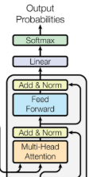
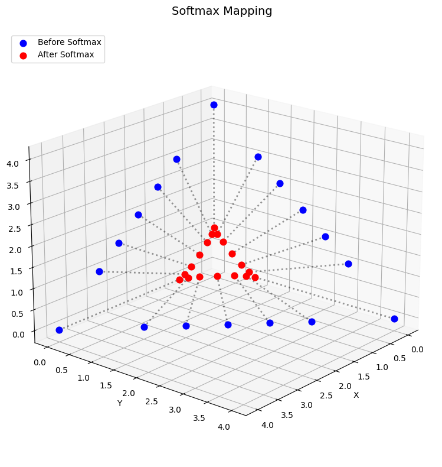

The goal of this article is to explain what temperature is in LLMs and how it changes the behaviour of the output of the LLMs.

I am focusing on this topic because temperature has become a critical lever in modern prompt engineering. A less-known parameter that users now frequently adjust to balance precision against creativity. To provide a clear, technical foundation, this article focuses exclusively on the role of temperature during inference, where it functions as an active control knob rather than a fixed model weight.

<!-- Before diving into the math, it helps to have a clear picture of what an LLM is actually doing at inference time. At its core, a decoder-only language model is a next-token predictor: given a sequence of tokens  (words or sub-words), it tries to predict which token should come next.  To do this, the model's final linear layer produces a raw score, called  a **logit**, for every token in its vocabulary, which can easily be in  the tens of thousands. These logits are then converted into probabilities, from which the model samples its next output. The mechanism that performs  this conversion, and the parameter that controls *how* it samples, are 
exactly what this article is about. 

Before we dive into the concept of **temperature**, we first need to understand the *Softmax* function and how it shapes the model's choices.
Before diving into the math, it helps to understand what an LLM is doing when it generates text. -->

At its core, a decoder-only model is a next-token predictor. Given a sequence of words (or sub-words), it calculates which token should come next. The process works in three quick steps:

- Scoring: The model’s final layer produces a raw score for every possible word in its vocabulary—a list that can easily reach tens of thousands. These raw scores are called logits.

- Conversion: Those logits are converted into a probability distribution, where each word is assigned a percentage likelihood.

- Sampling: Finally, the model samples from these probabilities to pick the actual word it will output.

This article explores the specific mechanism that performs this conversion and the **temperature** parameter that allows you to control how the model makes those choices. Before we get into temperature, however, we need to look at the **Softmax** function and how it shapes the model's decision-making process

## The Softmax Function and Its Properties

Suppose $n \in \mathbb{N}$ represents our vocabulary size, and $v \in \mathbb{R}^n$ is a vector of raw scores (called logits). We can represent $v$ as an $n$-tuple:

$$v = (v_1, v_2, \ldots, v_n)$$

with each component $v_i \in \mathbb{R}$.

The **Softmax** function $S:\mathbb{R}^n \to (0,1)^n$ normalizes these scores into values between 0 and 1:

$$S(v_i) = \frac{e^{v_i}}{\sum_{j=1}^n e^{v_j}}$$

One immediate observation is that the Softmax function outputs a valid probability distribution, meanin the elements are all positive and sum up to 1. It transforms any arbitrary vector of real numbers into a probability vector.

  <figure>
    
    <figcaption><strong>Model Architecture:</strong> The final layers of a decoder LLM, highlighting the <strong>Linear → Softmax</strong> pipeline that prepares token outputs.</figcaption>
  </figure>
  <figure>
    
    <figcaption><strong>Geometric Intuition:</strong> A 3D visualization showing raw logits (blue) being compressed into a bounded probability simplex (red).</figcaption>
  </figure>

Now that we have established how the Softmax function turns arbitrary logits into a valid probability distribution, we can look at how the model actually uses this probability map to generate text during inference

## The Token Generation Process in LLMs

In a decoder-only LLM, the main objective is to predict the next token (word or sub-word) in a sequence.

Right before the final output stage, the model's last linear layer produces a vector of unnormalized scores (logits) of the size of the vocabulary, where each element corresponds to a specific word in our vocabulary. If we wanted the model to pick only the single absolute best token, we would theoretically want an output vector that contains a `1` at the index of that best word and a `0` everywhere else.

Mathematically, this hard selection is represented by the **Argmax** function:

$$\text{Argmax}: \mathbb{R}^n \to \{0,1\}^n$$

$$\text{Argmax}_i(v) = \begin{cases} 1 & \text{if } v_i = \max\{v_1, \dots, v_n\} \\ 0 & \text{otherwise} \end{cases}$$

However, during training, the model needs to learn via gradient descent. The **Argmax** function is a step function; its derivative is zero almost everywhere, and it is completely discontinuous at the boundaries. Because it is **not differentiable**, we cannot backpropagate errors through it to update the model's weights.

This is exactly why we use **Softmax**. It acts as a "soft", continuous, and fully differentiable **approximation** of Argmax, turning raw scores into a smooth probability map that allows the network to train while still identifying the most likely next tokens.

 *Note: Despite its name, Softmax is not actually a soft approximation of the maximum function (infact the soft apporixmation of the maximum function is LogSumExp: $\log \sum e^{x_i}$). Instead, it is a soft approximation of the Argmax function, which is why many researchers prefer the more accurate term Softargmax.*

## **Soft (smooth) approximation**

What does it mean when we say **Softmax** is a soft **approximation** of Argmax? 

In simple terms, we are about to prove two extremes: if we drop the temperature to zero, the model becomes completely deterministic (Argmax). If we crank it to infinity, the model becomes completely random (Uniform Distribution). In th following we first mathematically define *approximation* and  prove exactly how two extremes happen.

Here are two ways to say that a sequence of functions $f_1, f_2, \ldots$ (each mapping $\mathbb{R}^n \to [0,1]^n$) gets closer to a target function $f$.

- **Pointwise convergence:** Fix one input $x$. As $k$ grows, the output $f_k(x)$ approaches $f(x)$.

- **Uniform convergence:** The approximation is close *everywhere at once*. For large enough $k$, $f_k(x) \approx f(x)$ for every input $x \in \mathbb{R}^n$ — not just for one $x$ at a time.

*Note: Uniform convergence is the stronger notion: uniform $\Rightarrow$ pointwise, but not the other way around. We do not dig deep in the concept of convergence since the main objective ofthis article is about softmax role in LLMs. However the cutios reader can refer tho this very illustrative video: [here](https://www.youtube.com/watch?v=GsORKmBCLuI).*

Now suppose for each $T \in \mathbb{R}$ we define,

$$  
S_T:\mathbb{R}^n \to (0,1)^n \\
S_T(v_i) = \frac{e^{v_i/T}}{\sum_{j=1}^n e^{v_j/T}}
$$

$S_T$ in the above equation is called the **softmax function with temperature $T$**.

*Note*: It is worth being precise about *when* temperature plays a role. During **training**, the standard Softmax (implicitly with $T = 1$) is used to maintain differentiability and enable gradient-based learning. During **inference**, however, temperature becomes a tunable knob that controls the shape of the output distribution *after* the model's weights are frozen. Unless stated otherwise, every reference to temperature in this article refers to the **inference-time** setting.

$\boldsymbol{S_T \stackrel{T \to 0}{=} \bold{\text{Argmax}}}$

Let $M = \max_{j} v_j$ be the maximum value in the vector $v$. We want to prove that as $T \to 0^+$, the softmax distribution pointwise converges to the argmax distribution:

$$\lim_{T \to 0^+} S_T (v)_i = \text{Argmax}(v)_i$$

Let's evaluate the limit of the $i$-th component, $S_T(v_i)$:

$$\lim_{T \to 0^+} S_T(v_i) = \lim_{T \to 0^+} \frac{e^{v_i/T}}{\sum_{j=1}^n e^{v_j/T}}$$

We multiply both the numerator and the denominator by $e^{-M/T}$:

$$S_T(v_i) = \frac{e^{v_i/T} \cdot e^{-M/T}}{\left(\sum_{j=1}^n e^{v_j/T}\right) \cdot e^{-M/T}}$$

Using the exponent rule $e^a \cdot e^b = e^{a+b}$, we can rewrite this as:

$$S_T(v_i) = \frac{e^{(v_i - M)/T}}{\sum_{j=1}^n e^{(v_j - M)/T}}$$

In the denominator there is one index, like $k$, such that $v_k = M$. So, $(v_k - M) = 0$. Therefore, $e^{v_k-M} = e^{0/T} = e^0 = 1$. For other indices, we know $v_j < M$, so $(v_j - M)$ is a strictly negative constant. Let $c_j = v_j - M < 0$. As $T \to 0^+$, the exponent $\frac{c_j}{T} \to -\infty$. Consequently, $e^{(v_j - M)/T} \to 0$.

Thus, the limit of the denominator as $T \to 0^+$ is:

$$\lim_{T \to 0^+} \sum_{j=1}^n e^{(v_j - M)/T} = 1+0 = 1$$

Now, we evaluate the limit of the entire fraction by looking at the numerator for the two possible cases for $v_i$:

**Case 1: $v_i$ is not the maximum ($v_i < M$)**

If $v_i < M$, then $(v_i - M) < 0$.

$$\lim_{T \to 0^+} e^{(v_i - M)/T} = 0  \Longrightarrow \lim_{T \to 0^+} S_T(v_i)= \frac{0}{1} = 0$$

**Case 2: $v_i$ is the maximum ($v_i = M$)**

If $v_i = M$, then $(v_i - M) = 0$.

$$\lim_{T \to 0^+} e^{(v_i - M)/T} = e^0 = 1  \Longrightarrow \lim_{T \to 0^+} S_T(v_i)= \frac{1}{1}= 1 $$

Combining both cases, we get:
$$ \lim_{T \to 0^+} S_T(v_i)= \begin{cases}
1 & \text{if } v_i = \max(v) \\
0 & \text{otherwise}
\end{cases} $$

The above argument shows that the softmax function converges pointwise to the argmax function. This is why setting temperature$=0$ in an API call gives you the exact same response every time. The distribution collapses into a single point, forcing the model to always greedily pick the most likely token.

 *Note: However, this convergence is not uniform. In fact, since all of the $S_T$ functions are continuous, if they uniformly converged to a limit function $S$, then $S$ must be continuous too. However, the Argmax function is not continuous. In practical terms, this means that the  "sharpening" effect of lowering the temperature is **input-dependent**. For a logit vector where one score strongly dominates the others, even a  moderate temperature reduction will push the distribution close to deterministic. But for a logit vector where scores are nearly tied, you  may need to lower the temperature much further to achieve the same level of concentration. There is no single threshold temperature that produces the same behavior across all inputs. Simply put: **context always matters**.*

<!-- **$S_T \stackrel{T \to \infity}{=} \frac{1}{n} $** -->
$\boldsymbol{S_T \stackrel{T \to \infty}{=} \frac{1}{n}}$

let us prove the claim: by increasing the temperature, the functions $S_T$ converge to the uniform distribution $S(v)_i=\frac{1}{n}$.

Here is the mathematical proof.

**The Uniform Distribution:**
A discrete uniform distribution over $n$ items means each item has an equal probability of occurring. The probability for each item $i$ is exactly the "mean" or equal share of the total probability mass ($1$):

$$U(\mathbf{x})_i = \frac{1}{n}$$

For each $1 \leq j \leq n$,

$$\lim_{T \to \infty} e^{v_j/T} =e^{\lim_{T \to \infty} v_j/T} =  e^0 = 1$$

since $v_j$ is a constant real number.

Now, we apply this to both the numerator and the denominator of our softmax function.

**For the numerator:**

$$\lim_{T \to \infty} e^{v_i/T} = 1$$

**For the denominator:**
Because the limit of a finite sum is the sum of the limits, we get:

$$\lim_{T \to \infty} \sum_{j=1}^n e^{v_j/T} = \sum_{j=1}^n \left( \lim_{T \to \infty} e^{v_j/T} \right) = \sum_{j=1}^n 1$$

Summing the number $1$ exactly $n$ times simply gives us $n$:

$$\sum_{j=1}^n 1 = n$$

Putting the numerator and denominator back together, the limit of the entire fraction is:

$$\lim_{T \to \infty} S_T(v)_i = \frac{1}{n}$$

This proves that as the temperature approaches infinity, the softmax function completely ignores the original input values $v_i$. Every single class gets assigned the exact same probability of $\frac{1}{n}$, giving you a perfectly uniform distribution.

 In the context of LLMs, this means that if we reduce the temperature to exactly 0 (or almost 0), the model's outputs—the new tokens—will become deterministic. Normally, models like GPT run at a higher default temperature, which is why you can input the same query twice and get different answers (same meaning, but different grammar or vocabulary). Lowering the temperature to 0 eliminates this variance.
 On the other hand, when we increase the temperature ($T \to +\infty$), the limit of the functions $S_T$ converges to the uniform distribution $S(v)_i=\frac{1}{n}$. This means that the model assigns the exact same weight to every word in the vocabulary, resulting in completely random and chaotic outputs.

To make these theoretical claims concrete, the following short demonstration shows what temperature actually looks like in practice on a real language  model. The same prompt is submitted multiple times at progressively different 
temperature values 

<video controls autoplay muted loop width="100%" style="border-radius: 8px;">
  <source src="./assets/videos/temperature_vid.webm" type="video/webm">
<source src="./assets/videos/temperature_vid.mp4" type="video/mp4">
  Your browser does not support the video tag.
</video>

This short demonstration illustrates the effect of the **temperature** parameter on the output of a locally hosted language model. In text generation, temperature is applied during the sampling stage after softmax, controlling how strongly the model favors high-probability tokens. Lower temperatures generally produce more deterministic and conservative outputs, while higher temperatures increase variability and can lead to more unexpected generations.

For the experiment, I used **Ollama** to run `llama3.2:3b` locally on my own machine. The command `/set parameter temperature ...` is used to modify the generation temperature, and `/clear` is used before each run to remove the previous conversation history and make the comparison cleaner. I also fix the `seed` to improve reproducibility, although the role of seed will be discussed separately in a later blog post.

Since the experiment is performed with a relatively small 3B model running locally, the results should be interpreted as a practical illustration rather than a general benchmark. The goal is to provide an intuitive example of how temperature influences language model behavior.

To truly grasp how temperature warps the model's output, it helps to look at it geometrically. Because the Softmax function outputs probabilities that sum to 1, any 3-dimensional output (for a vocabulary of 3 words) must live on a flat, triangular surface called a probability simplex. This triangle connects the absolute certainty points: $(1,0,0)$, $(0,1,0)$, and $(0,0,1)$.

Let's fix a raw logit vector to observe how temperature moves the output probability across this space. In the following interactive plots, our model has output the raw scores²: 

$$v = [2.5, 1.0, -0.5]$$ 

#### Interactive: Convergence to Argmax
<iframe src="./assets/argmax_3d.html" width="80%" height="400px" frameborder="0" scrolling="no"></iframe>

In this first visualization, we lower the temperature from $T = 2.0$ down to near zero.

The Space: The $P_1$, $P_2$, and $P_3$ axes represent the probability assigned to each of our three logits. The gray outline is the simplex boundary.

**The Trajectory**: Follow the colored line. As $T$ decreases, the output distribution is aggressively pulled toward the corner vertex $(1, 0, 0)$. The model becomes 100% confident in $v_1$ (the maximum logit) and assigns 0% probability to the others.

**The Color**: The color gradient of the points maps to the temperature. Lighter/yellower points represent higher temperatures, while the darker/purple points show the temperature approaching $0$, where the point finally rests at the Argmax vertex.

#### Interactive: Convergence to Uniform Distribution
<iframe src="./assets/uniform_3d.html" width="80%" height="400px" frameborder="0" scrolling="no"></iframe>

Now, let's see what happens when we heat things up. Using the exact same initial logit vector $v = [2.5, 1.0, -0.5]$, we increase the temperature from $T = 1.0$ up to $T = 50.0$.

**The Trajectory:** Instead of moving toward a corner, the rising temperature ignores the differences between the raw scores. The point is pulled directly into the  center of the simplex (triangle), the coordinate $(1/3, 1/3, 1/3)$. At this center point, the model completely ignores the fact that $v_1$ was much larger than $v_3$. It assigns an equal $33.3\%$ probability to all three tokens, making the output completely random.

**The Color:** Again, the color gradient maps the temperature. The dark points represent the starting temperature, and as the color shifts to yellow, $T$ is approaching infinity, dragging the distribution to perfect uniformity.

## Information Theory: Temperature as an Entropy Dial

To truly understand the impact of temperature, we can look at it through the lens of Information Theory. In this context, temperature acts as a dial that controls the Shannon Entropy of our output distribution.

Shannon Entropy ($H$) measures the unpredictability, surprise, or "chaos" inside a probability distribution $P = (p_1, p_2, \ldots, p_n)$. It is defined as:

$$H(P) = -\sum_{i=1}^n p_i \ln(p_i)$$

(Note: we assume $0 \ln(0) = 0$ based on the limit $\lim_{x \to 0^+} x \ln x = 0$).

When we use the temperature-scaled Softmax function to generate our probabilities ($p_i = S_T(v_i)$), changing $T$ directly manipulates the entropy of the system. Let's look at our two extremes:

1. As $T \to 0^+$ (The Deterministic Limit)
We previously proved that as temperature approaches zero, the probability of the maximum logit approaches $1$, and all others approach $0$. Our distribution becomes a one-hot vector (e.g., $[1, 0, 0, \ldots, 0]$).
Plugging this into the entropy formula gives:

$$H = -\left( 1 \ln(1) + 0 \ln(0) + \dots \right) = 0$$

At zero temperature, the system has zero entropy. The LLM is utterly deterministic; there is zero "surprise" in what it will output next.

2. As $T \to \infty$ (The Chaotic Limit)
Conversely, as temperature approaches infinity, every token gets the exact same probability: $p_i = \frac{1}{n}$.
Plugging this uniform distribution into our formula:

$$H = -\sum_{i=1}^n \left( \frac{1}{n} \ln\left(\frac{1}{n}\right) \right) = -n \left( \frac{1}{n} \ln\left(\frac{1}{n}\right) \right) = \ln(n)$$

Here, $\ln(n)$ represents the absolute maximum possible entropy for a system with $n$ choices.

This behavior holds true for any arbitrary input vector $v$. By adjusting the temperature, we are shifting the machine (the LLM) anywhere between absolute certainty (0 entropy) and absolute randomness (maximum entropy).

## Truncation Sampling: Top-k and Top-p

After the Softmax function (with our chosen temperature) processes the logits, we are left with a valid probability distribution. But we are not done yet—we still need to actually pick a token.

If we always choose the token with the highest probability (a strategy called Greedy Search or Argmax), the output becomes highly repetitive, robotic, and boring. To achieve natural language and creativity, we need to treat the distribution like a weighted roulette wheel and sample from it.

However, LLMs have vocabulary sizes in the tens of thousands. Even with temperature scaling, there is a "long tail" of thousands of irrelevant, ungrammatical, or nonsensical tokens that still possess a tiny fractional probability. If you generate a long essay, the model will eventually "roll" a bad number and pick one of these nonsense words. To prevent this, we use Truncation Sampling to cut off the tail before we sample.

Top-k Sampling
Instead of considering the whole vocabulary, we sort the tokens by probability and only keep the top $K$ tokens (e.g., $K=50$). The probability of all other tokens is forced to $0$.

Top-p (Nucleus) Sampling
Top-k is rigid; it keeps exactly $K$ tokens regardless of the model's confidence. Top-p is dynamic. We sort the tokens by probability and keep adding them to a pool until their cumulative probability crosses a threshold $p$ (e.g., $p=0.90$). If the model is highly confident in 2 tokens, the pool is small. If the model is unsure and probabilities are flat, it might keep 100 tokens to reach the 90% threshold.

Re-normalization and Sampling
Because we discarded the tail in both Top-k and Top-p, the probabilities of our surviving tokens no longer sum to $1$. We must re-normalize them by dividing each surviving probability by the new total sum.

Finally, we randomly sample from this truncated, re-normalized distribution. This weighted random selection is the exact reason why submitting the identical query to an LLM multiple times will yield completely different, yet mathematically valid, responses!

<!-- <iframe src="./assets/sampling_explorer.html" width="100%" height="1200px" frameborder="0" scrolling="no"></iframe> -->
<iframe class="iframe-sampling-explorer" src="./assets/sampling_explorer.html" frameborder="0"></iframe>

## Why Don't We Learn Temperature During Training?

A natural question arises: if temperature is so powerful at controlling the model's confidence, why is it only used at inference time? Why don't we set $T$ as a trainable parameter and let gradient descent optimize it?

During standard training, temperature is strictly set to $T = 1$. There are two main mathematical reasons for this: Scale Invariance and Gradient Instability.

Let's look at the derivative of the Softmax function $S_T(v)_i$ with respect to a specific input logit $v_j$.

If we define $\delta_{ij}$ as the Kronecker delta (1 if $i = j$, and 0 otherwise), the gradient is:

$$\frac{\partial S_T(v)_i}{\partial v_j} = \frac{1}{T} S_T(v)_i (\delta_{ij} - S_T(v)_j)$$

Notice the $\frac{1}{T}$ multiplier at the front.
If we were to allow $T$ to be a learnable parameter, we introduce severe instability to the backpropagation process. If the model pushes $T$ toward $0$, the gradients will explode (due to division by a tiny number). If $T$ grows large, the gradients vanish, halting learning entirely.

Furthermore, $T$ is mathematically redundant due to scale invariance. The logits $v$ are produced by the final linear layer: $v = Wx + b$. Because the temperature divides the logits ($\frac{v_i}{T}$), the model can achieve the exact same effect as changing $T$ by simply scaling its weights $W$ and biases $b$.
By fixing $T=1$, we force the model to learn the actual absolute magnitudes of its weights to express confidence, keeping the optimization landscape identifiable and stable.