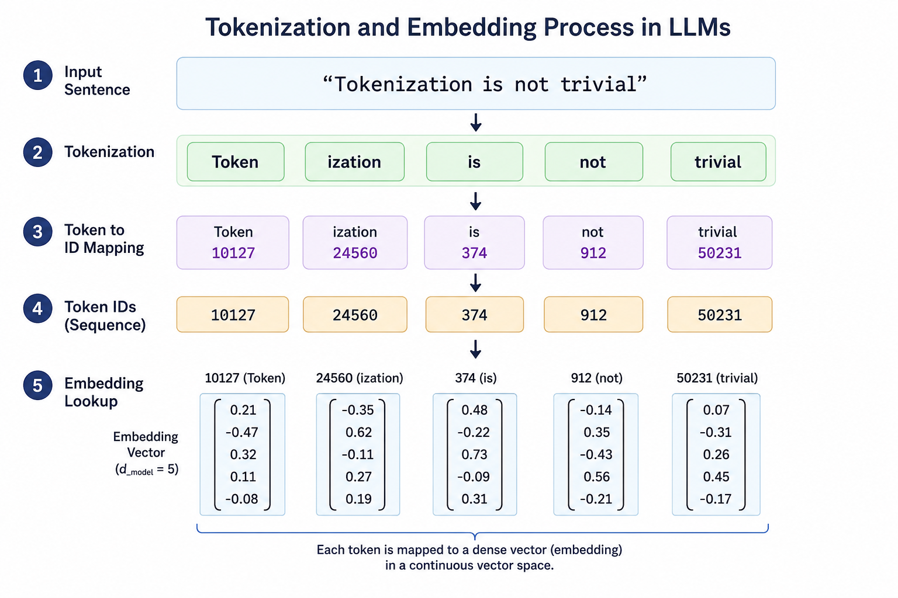

The idea of this article came to my mind when I was readig about LLM archtiecture and was trying to understand the difference between **Token**, **Tokenization**, **Token IDs** and **Token Represenations**. At first all of these look the same to me and it took some time for me to categorize them in my mind. This article is a try to create a mental map for someone who wants to go deep in these topics. 

In this article I first discuss about *Token* and *Tokenization* process in LLMs. Then we disucss about *Token Representations* process. But before that lets recall the trasformers architecture since it is our building block of this article. 


In the above figure you can see the **Input** and **Output** embeddings modules. In the training and inference step the whole process of tokenization happens before the embedding process (later we will see that this step is called *Token Representation*). 

## **Part I: Tokenization**

### **1.1 What is Token and Tokenization**  
Throughout this article, the word **token** is used frequently. A token is a **discrete unit of information processed by a model**. In domain of language models, a token usually represents a word, part of a word, a punctuation mark, or another piece of text. In other domains, however, tokens may represent image patches, audio segments, time-series windows, and so on. 

Before a model can process an input, it must first convert it into a sequence of tokens. The tokens themselves are not directly understood by the neural network. Instead, they must be converted into numbers using the model's Vocabulary—which is a fixed master list of every token the model is trained to recognize.

The total number of unique items in this list is the **Vocabulary Size**. Each token is mapped to its exact index number in this vocabulary, known as a **Token ID**. These token IDs are then transformed into meaningful vectors through an **embedding layer** (lke those in the figure) producing numerical representations that the model can process.

As a result, the pipeline looks as follows:

<center>Input → Tokens → Token IDs → Embeddings (Vectors)</center>

The process of converting an input into tokens is called **tokenization**. Lets make an example of the fist two steps the above process, meaning :

<center>Input → Tokens → Token IDs </center>





**Exmple:**

Let’s see how a simple sentence moves through the first two steps of the pipeline using a standard subword tokenizer (like the one used by GPT models).

- Input (Raw Text): > "Tokenization is not trivial"

- Tokens (Discrete Units): The tokenizer chops the text into pieces. Notice how "Tokenization" is broken into smaller subword units: [`Token`, `ization`, `is`, `fun`, `trivial`]

- Token IDs (Unique Integers): Each token is looked up in the model's pre-defined vocabulary dictionary and replaced by its corresponding mathematical ID:
$[10127, 24560, 374, 912, 50231]$


**Why do we need Token IDs after Tokenization?**

It is tempting to think that once we split a sentence into string-based tokens like `["Token", "ization","is","fun","!"]`, the hard part is over. However, computers and neural networks cannot perform mathematical operations on raw text strings. They operate strictly on matrices and vectors of floating-point numbers. 

Token IDs act as the bridge. By assigning every unique token in our vocabulary a fixed, unique integer index (e.g., `token` $\rightarrow$ `10127`), we create a structured lookup system that the neural network can interact with mathematically.

Think of this lookup table as a simple, two-way dictionary that handles two distinct phases:

* **Token to ID (Encoding):** When processing your input text, the system looks up each string token to find its corresponding index number.
  $$\text{`Token`} \longrightarrow \text{Lookup Table} \longrightarrow 10127$$

* **ID to Token (Decoding):** When the model generates a response, it outputs a raw number. This number is run backward through the exact same table to turn it back into a readable word for humans.
  $$10127 \longrightarrow \text{Lookup Table} \longrightarrow \text{`Token`}$$

<!-- **Are Token IDs Fixed or Learned?**

A common point of confusion is whether these IDs change as the model learns. **Token IDs are entirely fixed.** Once a tokenizer is trained and its vocabulary dictionary is locked in, the ID for a specific token never changes. For instance, in a BERT tokenizer, the token `"the"` will always map to the integer ID `1996`. What *does* change during the LLM's training are the **embedding vectors** associated with those IDs. The integer ID is simply a stable index used to point the model to the correct row in its embedding matrix. -->


**Where Do These Numbers Come From?**

A natural question arises: **how do we come up with these specific numbers in the first place?** 

This mapping isn't random, nor is it done manually. The process of tokenization is handled via a **Tokenizer Model** (such as Byte-Pair Encoding or WordPiece). Before the main Large Language Model (LLM) can even begin reading text, this tokenizer model must go through its own independent training phase.

When we say a tokenizer is "trained," we don't mean it uses complex neural networks. Instead, tokenizer training is a statistical optimization process. Its entire goal is to read a massive sample dataset of raw text, analyze it, and find the most efficient balance between character-level chunks and whole-word chunks to build its vocabulary list.

### **1.2 Tokenization Methods**

Modern LLMs rely on three primary algorithmic flavors to construct their vocabulary:

* **Byte-Pair Encoding (BPE)**: Starts with individual characters and iteratively merges the most frequent adjacent pairs. (Used by: GPT models, LLaMA).

* **WordPiece**: Similar to BPE, but instead of choosing the most frequent pair, it picks pairs based on a statistical likelihood that maximizes predictability. (Used by: BERT).

* **Unigram**: Starts with a massive vocabulary of full words and iteratively removes (prunes) the least useful tokens. (Used by: T5).

In the followig we dezcribe these three methods individually. 
#### **1.2.1 Byte-Pair Encoding (BPE)**

**Byte-Pair Encoding (BPE)** is a bottom-up subword tokenization method. It starts from a small base alphabet, usually characters or bytes, and gradually builds larger units by merging frequent adjacent pairs.

BPE was not originally designed for language models. It comes from **data compression**: the idea was to replace frequently repeated symbol pairs with a new symbol, making the sequence shorter. Modern NLP adapted the same idea for tokenization. Instead of only compressing text, BPE also produces a vocabulary of useful subword units.

**Intuition**

The core idea is:

$$
\text{frequent pair} \quad \Rightarrow \quad \text{good candidate for a new token}
$$

For example, if the pair `d` + `e` appears many times in the corpus, BPE may create a new token `de`. Later, if `de` + `r` is frequent, it may create `der`. In this way, BPE gradually builds larger subwords and sometimes full words.


**How BPE is Trained**

1. **Start from a base vocabulary**
   The corpus is first represented using a small set of atomic symbols, such as characters or bytes. In some versions, an end-of-word marker like `</w>` is added so that the algorithm can distinguish word boundaries.

1. **Count adjacent pairs**
   BPE scans the corpus and counts how often each neighboring pair of symbols appears. For example, it may count pairs such as `de`, `er`, `th`, or `in`.

1. **Choose the best immediate merge**
   The most frequent adjacent pair is selected. This is a greedy decision: BPE chooses the merge that gives the largest immediate reduction in sequence length.

   If a pair appears many times, replacing each occurrence of two symbols by one new symbol shortens the corpus:

   $$
   (a, b) \rightarrow ab
   $$

4. **Update the corpus**
   All selected occurrences of that pair are replaced by the new merged token. The corpus is now represented using this larger unit.

5. **Repeat until the vocabulary budget is reached**
   The algorithm repeats this process until it has learned the desired number of merge rules or reached the target vocabulary size.

**A Mathematical Perspective**

From a mathematical perspective, BPE is trying to find a sequence of merges:

$$
\mu = (\mu_1, \mu_2, \dots, \mu_M)
$$

that maximizes the *compression* utility of the corpus:

$$
\kappa_x(\mu)
$$

Here, $\kappa_x(\mu)$ measures how much shorter the sequence becomes after applying the merge sequence $\mu$. The ideal objective would be:

$$
\mu^\star = \arg\max_{\mu} \kappa_x(\mu)
$$

However, standard BPE does not search over all possible merge sequences, as that would be computationally expensive. Instead, it uses a greedy approximation: at each step, it chooses the merge with the best immediate gain.

Algorithm 3 of the paper [*A Formal Perspective on Byte-Pair Encoding*](https://arxiv.org/abs/2306.16837) gives a useful way to understand what “optimal BPE” would mean.

* Standard BPE is greedy: at each step, it merges the most frequent adjacent pair. This gives the best immediate compression gain, but it does not guarantee the best final vocabulary. A merge that looks good now may prevent a better sequence of merges later.

* Algorithm 3 takes a different approach. Instead of committing immediately to the most frequent pair, it searches over possible merge sequences and keeps the sequence that gives the best final compression. In other words, standard BPE asks, “Which pair should I merge now?”, while Algorithm 3 asks, “Which full sequence of merges gives the shortest final representation?”

This makes Algorithm 3 an exact method for finding an optimal BPE vocabulary under the compression objective. However, it is computationally expensive, so it is mainly useful for theoretical analysis rather than for training large real-world tokenizers.

For a practical and minimal implementation of standard BPE, Andrej Karpathy’s [*minbpe*](https://github.com/karpathy/minbpe) repository is a good reference. It implements the usual greedy version of BPE: count adjacent pairs, merge the most frequent pair, update the text, and repeat. This is different from Algorithm 3 in the formal paper, which searches for an optimal merge sequence. So `minbpe` is useful for understanding how BPE is used in practice, while Algorithm 3 is useful for understanding what an optimal BPE vocabulary would mean mathematically.


#### **1.2.2 WordPiece**

**WordPiece** is another bottom-up subword tokenization method, heavily utilized by models like BERT and DistilBERT. Structurally it is similar with BPE. Meaning, both of thel starting from a base alphabet and iteratively expanding the vocabulary. However then merging strategy is grounded in probability and information theory rather than raw frequency.

**Intuition**

<!-- Instead of merging the most *frequent* adjacent pair, WordPiece merges the pair that gives the largest **increase in likelihood** when added to the vocabulary — a score closely related to **pointwise mutual information (PMI)**:

$$
\text{score}(a, b) = \frac{\text{count}(a, b)}{\text{count}(a) \cdot \text{count}(b)}
$$ -->

A pair is a good merge candidate not because it's common, but because it's *more common together than its individual frequencies would predict*.


**How WordPiece is Trained**

1. **Initialize the vocabulary**

   Start with every individual character, punctuation mark, and special symbol found in the corpus (e.g., `p`, `h`, `e`, `t`, `##e`, `##t`...). The `##` prefix marks a character as one that only ever appears *inside* a word, never at its start — this is what lets the tokenizer later distinguish `##ing` (a suffix) from `ing` (a standalone word).

2. **Count pair frequencies**
   
Scan the corpus and count how often each adjacent symbol pair occurs — both together, e.g. `Count(p, ##h)`, and individually, e.g. `Count(p)` and `Count(##h)`.

3. **Score all adjacent pairs**

   For every neighboring pair $(a, b)$, compute:

   $$
   \text{Score}(a, b) = \frac{\text{Count}(ab)}{\text{Count}(a) \times \text{Count}(b)}
   $$

   This score is high when $a$ and $a$ co-occur more often than their individual frequencies would predict — not simply when $AB$ is common.

4. **Merge the highest-scoring pair**

   The pair with the highest score is merged into a new token. For instance, if `##p` and `##h` score highest, they merge into `##ph`, which is added to the vocabulary.

5. **Repeat until the vocabulary budget is reached**

   Re-scan the (now updated) corpus with the new token in place, recompute scores, and merge again. This repeats — one merge per iteration — until the vocabulary reaches its target size (e.g., 30,000 tokens).


The scoring formula introduced in step 2 above,

$$
\text{score}(a,b) = \frac{\text{Count}(a,b)}{\text{Count}(a)\,\text{Count}(b)}
$$

is often described as **Pointwise Mutual Information** or **PMI**. It's close, but not exact.

For two discrete events $\(x\)$ and $\(y\)$, PMI is defined as:
$$
\[
\operatorname{PMI}(x,y)
=
\log \frac{p(x,y)}{p(x)p(y)}
\]
$$
where:

- $\(p(x,y)\)$ is the joint probability of observing $\(x\)$ and $\(y\)$ together,
- $\(p(x)\)$ is the marginal probability of observing $\(x\)$,
- $\(p(y)\)$ is the marginal probability of observing $\(y\)$.

Equivalently, PMI can be written as:
$$
\[
\operatorname{PMI}(x,y)
=
\log \frac{p(x \mid y)}{p(x)}
=
\log \frac{p(y \mid x)}{p(y)}
\]$$

**A Mathematical Perspective**

We can write each count as a probability by dividing by the total number of tokens $N$: 
$$P(a) = \text{Count}(a)/N$$, 
and likewise for $P(b)$ and $P(a,b)$. So, 

$$
\frac{P(a,b)}{P(a)P(b)} = \frac{\text{Count}(a,b)/N}{\big(\text{Count}(a)/N\big)\big(\text{Count}(b)/N\big)} 
= N \cdot \frac{\text{Count}(a,b)}{\text{Count}(a)\,\text{Count}(b)} = N \cdot \text{score}(a,b)
$$

Therefore, 
$$\log\big(N \cdot \text{score}(a,b)\big) = \log N + \log\,\text{score}(a,b)$$
 — the raw score is off from PMI by an additive constant, $\log N$, in log-space.

This constant doesn't matter for choosing which pair to merge: at any single training step, $N$ is the same number for every candidate pair, so ranking pairs by $\text{score}(a,b)$ or by the true PMI gives identical results. That's why implementations use the simpler formula — it's not PMI, but it produces the same ranking as PMI would, which is all that's needed to pick a merge.

**Asymmetry**

One property survives in either formulation: WordPiece scores *ordered*, adjacent pairs, not general co-occurrence. Classical mutual information is symmetric, $\text{PMI}(X;Y) = \text{PMI}(Y;X)$, but here $A$ immediately followed by $B$ is a different event from $B$ immediately followed by $A$:

$$
\text{Count}(A,B) \neq \text{Count}(B,A) \;\implies\; \Delta\mathcal{LL}(A,B) \neq \Delta\mathcal{LL}(B,A)
$$

The algorithm is scoring directed sequential adjacency, not undirected association.

**The Dynamic Probability Space**

The training algorithm never optimizes against a fixed distribution. Every merge changes the counts that the *next* merge's scores depend on. When $A$ and $B$ merge into $AB$, three things shift in the corpus simultaneously:

- $\text{Count}(A)$ and $\text{Count}(B)$ both decrease (every merged occurrence is no longer counted as a standalone $A$ or $B$).
- $\text{Count}(AB)$ appears for the first time.
- Every other pair in the corpus that contains $A$ or $B$ has its own score affected, since its denominator terms just changed.

Because the landscape shifts after every merge, WordPiece is a **greedy algorithm** in a genuine, consequential sense: at step $t$ it makes the optimal choice for that instant's snapshot of $\Delta\mathcal{LL}$, with no lookahead. An early merge can reshape the probability space in a way that locks out a better final vocabulary — the same non-optimality trade-off discussed for BPE above, here driven by shifting counts rather than a fixed compression objective.

**Mathematical Bounds: Maximums and Minimums**

Using the simpler ratio-only score (since the bound analysis is cleaner in that form and the ranking is identical to the full $\Delta\mathcal{LL}$ criterion, as shown above):

- **Minimum ($0$):** the score is exactly $0$ when $A$ and $B$ never appear adjacent, $\text{Count}(a,b) = 0$. Pairs with large individual frequencies  but negligible co-occurrence approach $0$ as well.
- **Maximum ($1$):** since $\text{Count}(a,b)$ can never exceed $\text{Count}(a)$ or $\text{Count}(b)$, $1$ is the theoretical ceiling. It's reached only when $A$ and $B$ perfectly co-occur — they only ever appear together, so $\text{Count}(a,b) = \text{Count}(a) = \text{Count}(b) = k$, giving $\text{score}(a,b) = k/(k \times k) = 1/k$. Hitting the true maximum of $1$ requires $k = 1$: the highest possible score belongs to a pair that occurs   adjacent exactly once in the entire corpus and nowhere else.

This is precisely the flaw the frequency-weighted $\Delta\mathcal{LL}$ criterion corrects: the ratio alone rewards rare coincidences with the highest possible score, but a real implementation weights that score by $\text{Count}(a,b)$ before comparing candidates, which is why a one-off typo  never actually outranks a genuine subword in practice. *(Implementations also add a hard minimum-frequency threshold, e.g. discarding any pair with $\text{Count}(a,b) < 2$, as a second safeguard against this.)*

**Standard WordPiece vs. Fast WordPiece**

When exploring WordPiece implementations, a distinction is frequently made between **Standard WordPiece** and **Fast WordPiece** (often associated with Google's linear-time implementations and Hugging Face's Rust-based `tokenizers` library). This distinction centers purely on the execution efficiency of the tokenization step rather than the underlying vocabulary rules.

**Standard WordPiece**

Suppose we are given a word with $(m)$ characters and vocabulary ize of $(n)$.

One way to describe the cost is in terms of vocabulary lookup. If each candidate substring must be compared naively against a vocabulary of size (n), then in the **worst case the tokenizer may perform as many as
$
[
\mathcal{O}(mn)
]
$
comparisons: for each of the (m) possible character positions, it may need to search through all vocabulary entries to find whether a valid token exists.

Therefore, the inefficiency of standard WordPiece does not come from the vocabulary itself. It comes from the **search procedure**.

This is why standard WordPiece is often described as having worst-case complexity around
$
[
\mathcal{O}(m^2)
]
$
or, depending on the lookup implementation,
$
[
\mathcal{O}(mn).
]
$
For large-scale pretraining, where billions or trillions of words must be tokenized, this repeated backtracking can become a significant bottleneck.

* Note: In practice, vocabularies are usually stored in hash tables or tries, so lookup is much faster than a naive scan over all (n) tokens. 

**Fast WordPiece**


Fast WordPiece eliminates backtracking entirely by modeling the vocabulary as a specialized data structure known as a **Trie** (a prefix tree), augmented with advanced search mechanisms inspired by the **Aho-Corasick** string-matching algorithm.

* **Failure Links & Failure Pops:** In Fast WordPiece, every node in the vocabulary trie contains precomputed "failure links". If the tokenizer is stepping through the tree matching characters (e.g., tracking `s` $\rightarrow$ `t` $\rightarrow$ `r` $\rightarrow$ `a`) and hits a character that fails to match an edge, it does not reset and backtrack to the beginning of the word. Instead, it immediately follows a failure link to another precomputed node in the trie where a valid sub-match exists, emitting the tokens along the way ("failure pops").
* **Single-Pass End-to-End Processing:** While standard tokenizers use a two-step approach—first splitting an entire sentence into raw words using whitespaces/punctuation (pre-tokenization) and then passing each word individually to the subword loop—Fast WordPiece handles both simultaneously. It streams the entire raw sentence text through the trie in a **single linear pass**.

As a result, Fast WordPiece processes text in **strict $\mathcal{O}(n)$ time complexity** relative to the sentence length $n$, executing up to 5 to 8 times faster than traditional implementations without altering the final tokenized output.

#### **1.2.3 BPE and WordPiece Comparison**
 
**Concrete Tokenization Examples**

To illustrate how these trained vocabularies behave in practice, let us examine how both BPE and WordPiece process a sample sentence once training is complete.

Assume both tokenizers have been trained on an English corpus containing a mix of common and rare words, resulting in the following simplified vocabularies:
* **BPE Vocabulary:** `["the", "cat", "walk", "ed", "strang", "ely", "s", "a", "b", "c", ...]` (plus the end-of-word marker `</w>`)
* **WordPiece Vocabulary:** `["the", "cat", "walk", "##ed", "strang", "##ely", "##e", "a", "b", "c", ...]`

**BPE Tokenization Example**

BPE tokenizes text in a **bottom-up** fashion by looking up its learned *merge rules* in the exact chronological order they were discovered during training. 

Input word: `"strangely"`
1. The word is split into individual characters with an end-of-word marker: `s  t  r  a  n  g  e  l  y  </w>`
2. The tokenizer scans its merge rules list. The earliest rule matching any pair here is the one that created `strang`. The sequence becomes: `strang  e  l  y  </w>`
3. The next highest-priority merge rule in the vocabulary is for `ely`. The sequence becomes: `strang  ely  </w>`
4. No further valid merge rules apply.
* **Final BPE Tokens:** `["strang", "ely</w>"]` (often rendered simply as `["strang", "ely"]` with space indicators like `Ġstrang`, `ely` depending on the exact implementation).

**WordPiece Tokenization Example**

  WordPiece tokenizes text in a **top-down, greedy** fashion using an algorithm called **MaxMatch** (Maximum Matching). Instead of executing merge rules chronologically, it scans an isolated word from left to right, hunting for the longest string starting from the current position that exists in the vocabulary.

Input word: `"strangely"`
1. It looks at the whole string `"strangely"`. It is not in the vocabulary.
2. It chops letters off the end until it finds a match: `"strangely"` $\rightarrow$ `"strangel"` $\rightarrow$ `"strange"` $\rightarrow$ **`"strang"`** (Match found!).
3. The remaining substring is `"ely"`. Because it is a continuation of a word, the tokenizer looks for pieces prefixed with `##`.
4. It looks for `"##ely"`. (Match found!).
* **Final WordPiece Tokens:** `["strang", "##ely"]`


**The `[UNK]` Token**

The role of `[UNK]` becomes clear if we ask a simple question:

> What are the smallest units the tokenizer is allowed to use?

A tokenizer can only decompose text into units that exist in its vocabulary. If the smallest units are **characters**, then every character that may appear at inference time must already be known. If the tokenizer sees a character that was never included in its base vocabulary, it has no smaller unit to fall back to.

This is the situation with standard WordPiece.

Suppose the WordPiece vocabulary was built from English text and contains characters such as: a, b, c, ..., z.

Now imagine the model receives the word: cat🙂
The tokenizer can handle , a,b,c , but if the emoji `🙂` was never included in the base vocabulary, WordPiece cannot split it any further. The emoji is already a single Unicode character from the tokenizer’s point of view. There is no smaller known unit available. So the tokenizer gives up and outputs: `[UNK]`

The same problem can happen with rare mathematical symbols, foreign alphabets, or unusual Unicode characters. The issue is not that WordPiece is “bad”; the issue is that its fallback level is usually the **character level**, and the vocabulary is nor **rich** enough to cover every possible input.

Classical BPE can have the same problem if it also starts from a fixed character vocabulary. 

Byte-level BPE solves this by changing the **byte** level.

Instead of starting from characters, byte-level BPE starts from **bytes**. Every text string on a computer can be represented as a sequence of bytes, for example using UTF-8 encoding. So the base vocabulary has at least  256 possible byte values:


Byte-level BPE includes all 256 bytes in its base vocabulary. Therefore, even if the tokenizer sees a completely new character, it can always decompose that character into its underlying bytes.

For example: 🙂,

may be unknown as a character, but it is still representable as a sequence of UTF-8 bytes. Since those bytes are guaranteed to exist in the vocabulary, the tokenizer never gets stuck.

This is why WordPiece usually needs an explicit `[UNK]` token, while byte-level BPE can avoid it.

#### **1.2.4 Unigram**

While BPE and WordPiece build tokens from the bottom up (starting with single characters), the **Unigram** method works from the top down. It is often used alongside SentencePiece in models like T5.

**How It Works**
Unigram starts with a very large list of words and common word parts from the training text. Then, it carefully removes (prunes) the least useful pieces until it reaches the final vocabulary size.

**How Unigram is Trained**
1. **Start big:** Create a huge initial list of words and subwords.
2. **Find probabilities:** Calculate how likely each piece is to appear in the text based on its frequency.
3. **Test the impact:** The model looks at the whole text and asks: *"If I remove this token from my list, how much does it hurt my ability to represent the text accurately?"*
4. **Remove the least useful:** Tokens that have the smallest negative impact when removed are deleted. These are usually pieces that can easily be made by combining other, more common tokens.
5. **Repeat:** The model recalculates the probabilities and keeps removing tokens until the vocabulary is the right size.

Unlike BPE, which uses a strict rule to combine pieces, Unigram relies on probability. If a word can be split in several different ways, Unigram looks at the chances of each option and picks the most likely one.

### **1.3 SentencePiece: The Language-Independent Framework**

While BPE and WordPiece are powerful subword algorithms, they historically relied on a crucial first step: **pre-tokenization**. Before the algorithm could process the text, a script had to split the sentence into words based on spaces and punctuation (e.g., separating `"I love AI."` into `["I", "love", "AI", "."]`).

This creates a massive problem for language models intended to be multilingual. Languages like Chinese, Japanese, and Thai do not use spaces to separate words. Furthermore, different languages have complex and varying rules for punctuation, hyphens, and apostrophes. Relying on spaces and hardcoded punctuation rules makes a tokenizer fundamentally language-dependent.

**The SentencePiece Solution**

SentencePiece, developed by Google, solves this by acting as a language-independent wrapper around algorithms like BPE or Unigram. It achieves this by skipping the pre-tokenization (word-splitting) step entirely. 

Instead of discarding spaces, SentencePiece treats the entire input as a raw stream of characters and treats the space as just another standard letter. 

1. **Whitespace Escaping:** Before any subword algorithm is applied, SentencePiece replaces all spaces in the raw text with a special meta-symbol, usually a lower one-eighth block: `▁` (U+2581). 
   * *Raw Text:* `"Tokenization is fun!"`
   * *Escaped:* `"▁Tokenization▁is▁fun!"`

2. **Applying the Algorithm:** This escaped string is then fed into the core subword algorithm (like BPE for LLaMA, or Unigram for T5). The algorithm splits the text into tokens, but the `▁` remains physically attached to the beginning of the words.
   * *Tokens:* `["▁Token", "ization", "▁is", "▁fun", "!"]`

Notice how `"ization"` does not have the `▁` marker. This is how the model structurally understands that `"Token"` and `"ization"` belong to the exact same word and should not have a space between them.

**Lossless Detokenization**

The most significant advantage of this approach becomes apparent during **text generation (inference)**. 

In older tokenizers, when the model generated a sequence of tokens, the system had to use messy, hardcoded rules to figure out whether to put spaces between them (e.g., "Add a space between words, but don't add a space before a period or a comma"). 

With SentencePiece, the **detokenization** process is mathematically lossless and foolproof. It requires zero language-specific rules. The pipeline simply reverses the escaping process:

1. **Concatenation:** The generated string tokens are glued together exactly as they are outputted by the model. 
   (`"▁Token" + "ization" + "▁is" + "▁fun" + "!"` $\rightarrow$ `"▁Tokenization▁is▁fun!"`)
2. **Replacement:** The system performs a basic find-and-replace, swapping every `▁` symbol back into a standard, invisible whitespace.
   (`" Tokenization is fun!"`)

Because SentencePiece is an overarching framework, it is highly versatile. When you load a modern model like T5 or LLaMA, Hugging Face is quietly utilizing the SentencePiece library in the background to handle this precise `▁` spacing logic before passing the mathematical Token IDs to the model.

### **1.4 How Do We Evaluate a Tokenizer?**

Because tokenizers decide how efficiently a model processes text, it is important to measure their performance. Researchers look at a few key areas:

* **Compression Rate:** This measures how many tokens are needed to represent a single word on average. A lower score is better because it means the tokenizer is efficient. If one tokenizer needs 5 tokens to read the word "unbelievable" and another needs only 2, the second one uses the model's capacity much better.
* **Unknown Word Rate:** How often does the tokenizer have to use the `[UNK]` (Unknown) token? Modern tokenizers that can fall back to basic bytes usually have a rate of 0%, which is the ideal goal.
* **Fairness Across Languages:** Models that handle multiple languages are tested on how equally they treat them. If a tokenizer needs 1 token for an English sentence but 4 tokens for a sentence with the same meaning in Turkish, the model will be slower and more expensive to run for Turkish users. A good tokenizer works efficiently across many different languages.

### **1.5 Some Remarks on Tokenization**


1- **The Golden Rule: Once Learned, It is Frozen**

Once the tokenizer algorithm finishes its training phase and locks in its vocabulary table, the ID for a specific token is fixed. For example the token `"pug"` will *always* map to the integer ID `4`. Whether the model is being trained to understand language or is generating text for a user, this lookup table remains completely frozen. In short : **Token IDs are entirely fixed and never change during the LLM inference.** 


2- **The Multi-Step Role of the Tokenizer**

While we often use "tokenization" to refer to the whole text-to-ID pipeline, the tokenizer object in modern NLP libraries (like Hugging Face) actually handles several distinct steps in sequence:

1. **Normalization:** Cleaning the text (e.g., stripping whitespace, handling casing, removing accents).
2. **Pre-tokenization:** Splitting the raw text into rough boundaries, usually by spaces or punctuation.
3. **Model Tokenization:** Applying a core algorithmic rule (like BPE) to split words into subwords.
4. **Post-Processing:** Injecting model-specific special tokens (such as `[CLS]`, `[SEP]`, or `<|endoftext|>`).
5. **ID Mapping:** Converting the final array of tokens into their corresponding Token IDs.


## **Part II: Token Representation**

### **2.1 From Integers to Meaning**

At the end of the tokenization pipeline, we are left with an array of Token IDs—a sequence of integers like `[30121, 1634, 318, 1257, 0]`. While computers can process numbers, these raw integers are fundamentally inadequate for a neural network to understand *language*. 

Why? Because Token IDs are **categorical**, not **quantitative**. 

If the token `"king"` is assigned ID `1000` and the token `"apple"` is assigned ID `1001`, the mathematical proximity of these two numbers means absolutely nothing. They are just arbitrary labels. A neural network cannot multiply or add these IDs together to extract grammar, context, or meaning. 

This is where **Token Representation** (commonly referred to as **Embedding**) comes in. Token representation is the process of translating these rigid, arbitrary integers into rich, continuous mathematical objects called vectors.

### **2.2 The Embedding Layer: Building the Vector**

Before the discrete Token IDs enter the deep layers of the Transformer (like the Attention mechanisms), they pass through the **Embedding Layer**. Think of this layer as a massive lookup table, but instead of mapping a string to an integer, it maps an integer to a high-dimensional list of floating-point numbers.

Instead of representing `"Token"` as a single number (`30121`), the embedding layer represents it as a dense vector of hundreds or thousands of dimensions (often denoted as $d_{\text{model}}$):

$$ 30121 → [0.14, -0.88, 0.42, ..., 0.05]$$

Each dimension in this vector captures a tiny, abstract fraction of the token's semantic meaning. In this high-dimensional space, words with similar meanings (like `"king"` and `"queen"`) end up mathematically closer together, while unrelated words (like `"king"` and `"toaster"`) are pushed far apart. 

### **2.3 The Core Differences: Tokenization vs. Representation**

To build a clear mental map, it is crucial to separate these two phases conceptually. Here is how tokenization and token representation differ:

* **Fixed vs. Learned:**
  * **Tokenization** is a fixed, pre-processing step. Once the tokenizer is trained and its vocabulary dictionary is locked in, the ID for a specific token never changes. The word `"the"` will always be `1996` in a BERT model.
  * **Token Representation** is a dynamic, learned process. The vector assigned to ID `1996` starts as random noise and is continuously updated and refined via backpropagation during the LLM's training phase. The model *learns* what the token means by adjusting these floating-point numbers.

* **Syntax vs. Semantics:**
  * **Tokenization** only cares about syntax and structure. It is a statistical machine that asks: *"How do I efficiently chop this string of characters into smaller pieces?"* It has no understanding of what the words actually mean.
  * **Token Representation** cares entirely about semantics. It asks: *"What is the underlying meaning of this discrete piece, and how does it relate to all the other pieces in my vocabulary?"*

* **Hardware Execution:**
  * **Tokenization** is almost always executed on the **CPU**. It is a software-level string manipulation task using dictionaries, tries, or regular expressions.
  * **Token Representation** happens on the **GPU** (or TPU). The embedding layer is the very first true layer of the neural network, performing massive matrix multiplications.

In summary, if tokenization is the act of giving every word a unique ID badge to enter the building, token representation is the process of reading that badge to understand the person's entire background, skills, and relationship to everyone else in the room.


#### **2.4 Why We Cannot Simply Change the Tokenizer**

When working with pre-trained models, developers often ask: *"Can I just add new words to the tokenizer or replace it with a better one?"*

The short answer is: **If you change the tokenizer, you break the embeddings.**

Remember that the Embedding Layer is like a large lookup table. Each Token ID corresponds to a specific row in that table, which holds the vector (the mathematical meaning) for that token. 

If you train the tokenizer again or change it, the IDs will get mixed up. For example, the word `"apple"` might move from ID `500` to ID `2104`. If you give ID `2104` to the original model, it will look up row `2104`, which used to belong to a completely different word. The result will be meaningless output.

**How do we add new words, then?**
If you need to add new tokens (for example, for specific medical terms or a new language), you must carefully expand the model:
1. Add the new tokens to the tokenizer's vocabulary.
2. Add new, empty rows to the bottom of the model's embedding matrix so it gets larger.
3. Fill these new rows with starting values. You can use random numbers, or you can average the values of the smaller pieces that used to make up the new word.
4. **Train the model again (Fine-tune).** You must train the model so it can learn the correct mathematical meaning for these newly added vectors.


## **Part III: Some Concrete examples**

### **3.1 Different Models, Different Tokenization**

In the following example I demonstrate how five different models tokenize the same texts You can see the pipeline here: [code](https://github.com/erfansoheil/erfansoheil.github.io/blob/main/writing-notes/tokenization/main.ipynb). Everythig (downlaoding and loading) is handled by `AutoTokenizer` module in `transformers` library. 


Text: `Tokenization is not trivial.` 


| Model                  | Tokens                                                  | Token IDs                                          |
| ------------------------| ---------------------------------------------------------| ----------------------------------------------------|
| BERT WordPiece         | `[[CLS], token, ##ization, is, not, trivial, ., [SEP]]` | `[101, 19204, 3989, 2003, 2025, 20610, 1012, 102]` |
| GPT-2 Byte-level BPE   | `[Token, ization, Ġis, Ġnot, Ġtrivial, .]`              | `[30642, 1634, 318, 407, 20861, 13]`               |
| RoBERTa Byte-level BPE | `[<s>, Token, ization, Ġis, Ġnot, Ġtrivial, ., </s>]`   | `[0, 45643, 1938, 16, 45, 30063, 4, 2]`            |
| T5 SentencePiece       | `[▁To, ken, ization, ▁is, ▁not, ▁trivia, l, ., </s>]`   | `[304, 2217, 1707, 19, 59, 22377, 40, 5, 1]`       |
| LLaMA-style tokenizer  | `[<s>, ▁Token, ization, ▁is, ▁not, ▁trivial, .]`        | `[1, 25159, 2133, 338, 451, 12604, 29889]`         |
| Qwen-small             | `[Token, ization, Ġis, Ġnot, Ġtrivial, .]`              | `[3323, 2022, 374, 537, 35647, 13]`                |


Text: `unbelievable`

| Model                  | Tokens                            | Token IDs                       |
| ------------------------| -----------------------------------| ---------------------------------|
| BERT WordPiece         | `[[CLS], unbelievable, [SEP]]`    | `[101, 23653, 102]`             |
| GPT-2 Byte-level BPE   | `[un, bel, iev, able]`            | `[403, 6667, 11203, 540]`       |
| RoBERTa Byte-level BPE | `[<s>, un, bel, iev, able, </s>]` | `[0, 879, 8494, 18421, 868, 2]` |
| T5 SentencePiece       | `[▁unbelievable, </s>]`           | `[25525, 1]`                    |
| LLaMA-style tokenizer  | `[<s>, ▁un, bel, iev, able]`      | `[1, 443, 6596, 10384, 519]`    |
| Qwen-small             | `[un, belie, vable]`              | `[359, 31798, 23760]`           |


Text: `I love machine learning 😊`


| Model                  | Tokens                                                                     | Token IDs                                               |
| ------------------------| ----------------------------------------------------------------------------| ---------------------------------------------------------|
| BERT WordPiece         | `[[CLS], i, love, machine, learning, [UNK], [SEP]]`                        | `[101, 1045, 2293, 3698, 4083, 100, 102]`               |
| GPT-2 Byte-level BPE   | `[I, Ġlove, Ġmachine, Ġlearning, ĠðŁĺ, Ĭ]`                                 | `[40, 1842, 4572, 4673, 30325, 232]`                    |
| RoBERTa Byte-level BPE | `[<s>, I, Ġlove, Ġmachine, Ġlearning, ĠðŁĺ, Ĭ, </s>]`                      | `[0, 100, 657, 3563, 2239, 17841, 27969, 2]`            |
| T5 SentencePiece       | `[▁I, ▁love, ▁machine, ▁learning, ▁, <unk>, </s>]`                         | `[27, 333, 1437, 1036, 3, 2, 1]`                        |
| LLaMA-style tokenizer  | `[<s>, ▁I, ▁love, ▁machine, ▁learning, ▁, <0xF0>, <0x9F>, <0x98>, <0x8A>]` | `[1, 306, 5360, 4933, 6509, 29871, 243, 162, 155, 141]` |
| Qwen-small             | `[I, Ġlove, Ġmachine, Ġlearning, ĠðŁĺ, Ĭ]`                                 | `[40, 2948, 5662, 6832, 26525, 232]`                    |

**Key Takeaways from the Tables**

Looking at how different models handle the exact same text shows us a few important differences:

* **Handling Spaces:** Notice how the models show spaces between words. GPT-2, RoBERTa, and Qwen use `Ġ` to represent a space. T5 and LLaMA use `▁`. BERT, however, removes spaces completely and uses `##` to show that a piece belongs to the word before it (like `##ization`).
* **The Emoji Problem:** Look at the example with the "😊" emoji. BERT does not recognize it and replaces it with an unknown token, `[UNK]`. T5 also outputs `<unk>`. But GPT-2, RoBERTa, and LLaMA handle it smoothly by breaking the emoji down into basic computer bytes. LLaMA splits the emoji into its raw byte codes (like `<0xF0>`). This ensures the model does not lose the information, even if the exact emoji is not in its main vocabulary.
* **Different Word Splits:** For the word "unbelievable", every model makes a different choice. GPT-2 splits it into four parts (`un`, `bel`, `iev`, `able`), while T5 keeps it as one complete word (`▁unbelievable`). This shows how a model's training data changes how it breaks down text.


### **3.2 What Are These Tokenizer Files on Hugging Face?**

When you download a tokenizer from Hugging Face, you usually get several files rather than a single one. Together, they describe **how text is split into tokens, how tokens are mapped to IDs, and how the model should use that tokenizer**.

Common files include:

```text
config.json
tokenizer.json
tokenizer_config.json
vocab.json
merges.txt
```

Not every tokenizer has all of them. The exact files depend on the tokenizer family (BPE, WordPiece, SentencePiece, etc.).

#### **`tokenizer.json`**

This is often the **main tokenizer file**. It usually stores the full tokenizer pipeline: normalization, pre-tokenization, subword model, post-processing, and decoding. In many Hugging Face **fast tokenizers**, this file is enough to reconstruct the tokenizer.

#### **`tokenizer_config.json`**

This contains **Hugging Face-specific tokenizer settings**, such as the tokenizer class, maximum input length, lowercasing behavior, padding/truncation defaults, and special token settings. It is more like **wrapper metadata** than the tokenizer algorithm itself.

#### **`vocab.json`**

This is the **vocabulary dictionary**: it maps token strings to integer token IDs. For example, it may store entries like

$$
\texttt{"hello"} \to 31373
$$

It tells us **which tokens exist and what IDs they have**.

#### **`merges.txt`**

This appears in **BPE tokenizers**. It stores the ordered list of merge rules learned during BPE training. In other words, it helps define **how smaller units are merged into larger subword tokens**. That is why BPE tokenizers often need both `vocab.json` and `merges.txt`.

#### **`config.json`**

This one is usually **the model configuration file**, not the tokenizer file. It typically stores architecture-level information such as the hidden size, number of layers, number of attention heads, vocabulary size, and special token IDs. So it belongs more to the **language model** than to the tokenizer itself.


## **Conclusion**

When working with Large Language Models, it is easy to view the input process as one big mystery. However, separating **Tokenization** from **Token Representation** makes it much easier to understand how these models process text.

* **Tokenization** is a strict, rule-based step. It runs on standard processors (CPUs), uses statistical rules learned from text, and cuts words into simple numbers (Token IDs). It does not understand what the words actually mean.
* **Token Representation (Embeddings)** is where the model starts to understand. It runs on specialized processors (GPUs). It takes those simple numbers and turns them into complex mathematical vectors. In this step, the model learns grammar, context, and meaning. 

By understanding this full path—from standard text, to token pieces, to integer IDs, and finally to mathematical vectors—you can better understand both the limits and the real power of modern language models.