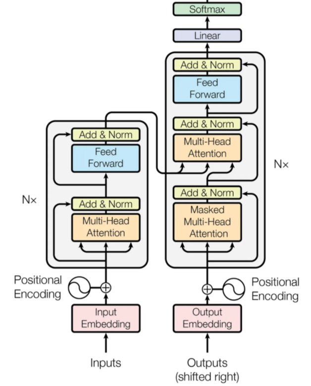

The idea of this article came to my mind when I was readig about LLM archtiectures and was trying to understand the difference between **Token**, **Tokenization**, **Token IDs** and **Token Represenations**. At first all of these look the same to me and it took some time for me to categorize them in my mind. This articel is a try to create a mental map for someone who wants to go deep in these topics. 

In this artcile I first discuss about *Token* and *Tokenization* process in LLMs. Then we disucss about *Token Representations* process. Before that lets recall the trasdformers architecture since it is our building block of this article. 

In the above figure you can see the **Input** and **Output** embeddings moduls. The whole process of tokenization happens before embedding process (later we see that thsi step called *Token Representation*)

## **Part I: Tokenization**

### **1.1 What is Token and Tokenization**  
Throughout this article, the word **token** is used frequently. A token is a **discrete unit of information processed by a model**. In domain of language models, a token usually represents a word, part of a word, a punctuation mark, or another piece of text. In other domains, however, tokens may represent image patches, audio segments, time-series windows, and so on.

Before a model can process an input, it must first convert it into a sequence of tokens. The tokens themselves are not directly understood by the neural network. Instead, they must be converted into numbers using the model's Vocabulary—which is a fixed master list of every token the model is trained to recognize.

The total number of unique items in this list is the Vocabulary Size. Each token is mapped to its exact index number in this vocabulary, known as a Token ID. These token IDs are then transformed into meaningful vectors through an **embedding layer**, producing numerical representations that the model can process.

As a result, the pipeline looks as follows:

Input → Tokens → Token IDs → Embeddings (Vectors)

The process of converting an input into tokens is called **tokenization**. Lets make an example of the fist two steps the above process, meaning :

Input → Tokens → Token IDs 

<!-- , while the process of converting token IDs into vectors is called **embedding**. -->

**Exmple :**

Let’s see how a simple sentence moves through the first two steps of the pipeline using a standard subword tokenizer (like the one used by GPT models).

- Input (Raw Text): > "Tokenization is fun!"

- Tokens (Discrete Units): The tokenizer chops the text into pieces. Notice how "Tokenization" is broken into smaller subword units:
$[\text{Token}, \text{ization}, \text{is}, \text{fun}, \text{!}]$

- Token IDs (Unique Integers): Each token is looked up in the model's pre-defined vocabulary dictionary and replaced by its corresponding mathematical ID:
$[30121, 1634, 318, 1257, 0]$

**Why do we need Token IDs after Tokenization?**

It is tempting to think that once we split a sentence into string-based tokens like `["Token", "ization","is","fun","!"]`, the hard part is over. However, computers and neural networks cannot perform mathematical operations on raw text strings. They operate strictly on matrices and vectors of floating-point numbers. 

Token IDs act as the bridge. By assigning every unique token in our vocabulary a fixed, unique integer index (e.g., `"token"` $\rightarrow$ `2534`), we create a structured lookup system that the neural network can interact with mathematically.

Think of this lookup table as a simple, two-way dictionary that handles two distinct phases:

* **Token to ID (Encoding):** When processing your input text, the system looks up each string token to find its corresponding index number.
  $$\text{"Token"} \longrightarrow \text{Lookup Table} \longrightarrow 30121$$

* **ID to Token (Decoding):** When the model generates a response, it outputs a raw number. This number is run backward through the exact same table to turn it back into a readable word for humans.
  $$30121 \longrightarrow \text{Lookup Table} \longrightarrow \text{"Token"}$$

<!-- **Are Token IDs Fixed or Learned?**

A common point of confusion is whether these IDs change as the model learns. **Token IDs are entirely fixed.** Once a tokenizer is trained and its vocabulary dictionary is locked in, the ID for a specific token never changes. For instance, in a BERT tokenizer, the token `"the"` will always map to the integer ID `1996`. What *does* change during the LLM's training are the **embedding vectors** associated with those IDs. The integer ID is simply a stable index used to point the model to the correct row in its embedding matrix. -->

**Where Do These Numbers Come From?**

A natural question arises: **how do we come up with these specific numbers in the first place?** 

This mapping isn't random, nor is it done manually. The process of tokenization is handled via a **Tokenizer Model** (such as Byte-Pair Encoding or WordPiece). Before the main Large Language Model (LLM) can even begin reading text, this tokenizer model must go through its own independent training phase.

When we say a tokenizer is "trained," we don't mean it uses complex neural networks. Instead, tokenizer training is a statistical optimization process. Its entire goal is to read a massive sample dataset of raw text, analyze it, and find the most efficient balance between character-level chunks and whole-word chunks to build its vocabulary list.

### **1.2 Tokenization Methods**

Modern LLMs rely on three primary algorithmic flavors to construct their vocabulary:

* **Byte-Pair Encoding (BPE)**: Starts with individual characters and iteratively merges the most frequent adjacent pairs. (Used by: GPT models, LLaMA).

* **WordPiece**: Similar to BPE, but instead of choosing the most frequent pair, it picks pairs based on a statistical likelihood that maximizes predictability. (Used by: BERT).

* **Unigram**: Starts with a massive vocabulary of full words and iteratively removes (prunes) the least useful tokens. (Used by: T5).

In the followig we dezcribe these three methods individually. 
#### **1.1.1 Byte-Pair Encoding (BPE)**

**Byte-Pair Encoding (BPE)** is a bottom-up subword tokenization method. It starts from a small base alphabet, usually characters or bytes, and gradually builds larger units by merging frequent adjacent pairs.

BPE was not originally designed for language models. It comes from **data compression**: the idea was to replace frequently repeated symbol pairs with a new symbol, making the sequence shorter. Modern NLP adapted the same idea for tokenization. Instead of only compressing text, BPE also produces a vocabulary of useful subword units.

**Intuition**

The core idea is:

$$
\text{frequent pair} \quad \Rightarrow \quad \text{good candidate for a new token}
$$

For example, if the pair `d` + `e` appears many times in the corpus, BPE may create a new token `de`. Later, if `de` + `r` is frequent, it may create `der`. In this way, BPE gradually builds larger subwords and sometimes full words.

**How BPE is Trained**

1. **Start from a base vocabulary**
   The corpus is first represented using a small set of atomic symbols, such as characters or bytes. In some versions, an end-of-word marker like `</w>` is added so that the algorithm can distinguish word boundaries.

2. **Count adjacent pairs**
   BPE scans the corpus and counts how often each neighboring pair of symbols appears. For example, it may count pairs such as `d e`, `e r`, `t h`, or `i n`.

3. **Choose the best immediate merge**
   The most frequent adjacent pair is selected. This is a greedy decision: BPE chooses the merge that gives the largest immediate reduction in sequence length.

   If a pair appears many times, replacing each occurrence of two symbols by one new symbol shortens the corpus:

   $$
   (a, b) \rightarrow ab
   $$

4. **Update the corpus**
   All selected occurrences of that pair are replaced by the new merged token. The corpus is now represented using this larger unit.

5. **Repeat until the vocabulary budget is reached**
   The algorithm repeats this process until it has learned the desired number of merge rules or reached the target vocabulary size.

**A Mathematical Perspective**

From a mathematical perspective, BPE is trying to find a sequence of merges:

$$
\mu = (\mu_1, \mu_2, \dots, \mu_M)
$$

that maximizes the *compression* utility of the corpus:

$$
\kappa_x(\mu)
$$

Here, $(\kappa_x(\mu))$ measures how much shorter the sequence becomes after applying the merge sequence $(\mu)$. The ideal objective would be:

$$
\mu^\star = \arg\max_{\mu} \kappa_x(\mu)
$$

However, standard BPE does not search over all possible merge sequences, as that would be computationally expensive. Instead, it uses a greedy approximation: at each step, it chooses the merge with the best immediate gain.

Algorithm 3 of the paper [*A Formal Perspective on Byte-Pair Encoding*](https://arxiv.org/abs/2306.16837) gives a useful way to understand what “optimal BPE” would mean.

* Standard BPE is greedy: at each step, it merges the most frequent adjacent pair. This gives the best immediate compression gain, but it does not guarantee the best final vocabulary. A merge that looks good now may prevent a better sequence of merges later.

* Algorithm 3 takes a different approach. Instead of committing immediately to the most frequent pair, it searches over possible merge sequences and keeps the sequence that gives the best final compression. In other words, standard BPE asks, “Which pair should I merge now?”, while Algorithm 3 asks, “Which full sequence of merges gives the shortest final representation?”

This makes Algorithm 3 an exact method for finding an optimal BPE vocabulary under the compression objective. However, it is computationally expensive, so it is mainly useful for theoretical analysis rather than for training large real-world tokenizers.

For a practical and minimal implementation of standard BPE, Andrej Karpathy’s [*minbpe*](https://github.com/karpathy/minbpe) repository is a good reference. It implements the usual greedy version of BPE: count adjacent pairs, merge the most frequent pair, update the text, and repeat. This is different from Algorithm 3 in the formal paper, which searches for an optimal merge sequence. So `minbpe` is useful for understanding how BPE is used in practice, while Algorithm 3 is useful for understanding what an optimal BPE vocabulary would mean mathematically.

#### **1.1.2 WordPiece**

**WordPiece** is another bottom-up subword tokenization method, heavily utilized by models like BERT and DistilBERT. Structurally it is similar with BPE. Meaning, both of thel starting from a base alphabet and iteratively expanding the vocabulary. However then merging strategy is grounded in probability and information theory rather than raw frequency.

**Intuition**

Instead of merging the most *frequent* adjacent pair, WordPiece merges the pair that gives the largest **increase in likelihood** when added to the vocabulary — a score closely related to *pointwise mutual information*:

$$
\text{score}(a, b) = \frac{\text{count}(a, b)}{\text{count}(a) \cdot \text{count}(b)}
$$

A pair is a good merge candidate not because it's common, but because it's *more common together than its individual frequencies would predict*.

**How WordPiece is Trained**

1. **Initialize the vocabulary**
   Start with every individual character, punctuation mark, and special symbol found in the corpus (e.g., `p`, `h`, `e`, `t`, `##e`, `##t`...). The `##` prefix marks a character as one that only ever appears *inside* a word, never at its start — this is what lets the tokenizer later distinguish `##ing` (a suffix) from `ing` (a standalone word).

2. **Count pair frequencies**
   Scan the corpus and count how often each adjacent symbol pair occurs — both together, e.g. `Count(p, ##h)`, and individually, e.g. `Count(p)` and `Count(##h)`.

3. **Score all adjacent pairs**
   For every neighboring pair $(A, B)$, compute:

   $$
   \text{Score}(A, B) = \frac{\text{Count}(AB)}{\text{Count}(A) \times \text{Count}(B)}
   $$

   This score is high when $A$ and $B$ co-occur more often than their individual frequencies would predict — not simply when $AB$ is common.

4. **Merge the highest-scoring pair**
   The pair with the highest score is merged into a new token. For instance, if `##p` and `##h` score highest, they merge into `##ph`, which is added to the vocabulary.

5. **Repeat until the vocabulary budget is reached**
   Re-scan the (now updated) corpus with the new token in place, recompute scores, and merge again. This repeats — one merge per iteration — until the vocabulary reaches its target size (e.g., 30,000 tokens).

**A Mathematical Perspective**
**Method 2: WordPiece**

**WordPiece** is another bottom-up subword tokenization method, heavily utilized by models like BERT and DistilBERT. Structurally, it is similar to BPE. Meaning, both of them start from a base alphabet and iteratively expand the vocabulary. However, their merging strategy is grounded in probability and information theory rather than raw frequency.

**Intuition**

Instead of merging the most *frequent* adjacent pair, WordPiece merges the pair that gives the largest **increase in likelihood** when added to the vocabulary — a score closely related to *pointwise mutual information*:

$$
\text{score}(a, b) = \frac{\text{count}(a, b)}{\text{count}(a) \cdot \text{count}(b)}
$$

A pair is a good merge candidate not because it's common, but because it's *more common together than its individual frequencies would predict*.

**How WordPiece is Trained**

1. **Initialize the vocabulary**
   Start with every individual character, punctuation mark, and special symbol found in the corpus (e.g., `p`, `h`, `e`, `t`, `##e`, `##t`...). The `##` prefix marks a character as one that only ever appears *inside* a word, never at its start — this is what lets the tokenizer later distinguish `##ing` (a suffix) from `ing` (a standalone word).

2. **Count pair frequencies**
   Scan the corpus and count how often each adjacent symbol pair occurs — both together, e.g., `Count(p, ##h)`, and individually, e.g., `Count(p)` and `Count(##h)`.

3. **Score all adjacent pairs**
   For every neighboring pair $(A, B)$, compute:

   $$
   \text{Score}(A, B) = \frac{\text{Count}(AB)}{\text{Count}(A) \times \text{Count}(B)}
   $$

   This score is high when $A$ and $B$ co-occur more often than their individual frequencies would predict — not simply when $AB$ is common.

4. **Merge the highest-scoring pair**
   The pair with the highest score is merged into a new token. For instance, if `##p` and `##h` score highest, they merge into `##ph`, which is added to the vocabulary.

5. **Repeat until the vocabulary budget is reached**
   Re-scan the (now updated) corpus with the new token in place, recompute scores, and merge again. This repeats — one merge per iteration — until the vocabulary reaches its target size (e.g., 30,000 tokens).

**Mathematical Properties of the WordPiece**

To understand the theoretical foundation of WordPiece, we must look at the mathematical implications of its scoring function. While Byte-Pair Encoding (BPE) relies on a simple linear frequency count, WordPiece introduces a probabilistic lens that fundamentally changes which tokens are prioritized.

#**Connection to Information Theory and Asymmetry**

The WordPiece scoring function is directly derived from **Pointwise Mutual Information (PMI)**. If we divide the counts in the scoring formula by the total number of tokens $N$, we convert counts into probabilities:

$$
\text{score}(a, b) = \frac{P(a, b)}{P(a)P(b)}
$$

Taking the logarithm of this ratio yields the exact formula for PMI. From an information-theoretic perspective, WordPiece asks: *How much does the presence of token $A$ reduce our uncertainty about the immediate presence of token $B$?* However, there is a crucial mathematical distinction between classical PMI and the WordPiece score regarding **symmetry**. In classical information theory, mutual information is symmetric: $\text{PMI}(X; Y) = \text{PMI}(Y; X)$. But WordPiece operates on *ordered sequential pairs*. The event of token $A$ being followed by token $B$ is completely distinct from token $B$ being followed by token $A$. Therefore:

$$
\text{Count}(A, B) \neq \text{Count}(B, A) \implies \text{Score}(A, B) \neq \text{Score}(B, A)
$$

The algorithm evaluates the directed sequence, not just general co-occurrence.

**The Dynamic Probability Space**

It is vital to recognize that the WordPiece training algorithm does not operate on a static distribution. **Every time a merge occurs, the underlying probability space changes.** When tokens $A$ and $B$ are merged into a new token $AB$, three mathematical shifts happen instantly in the corpus distribution:
* The independent counts $\text{Count}(A)$ and $\text{Count}(B)$ decrease.
* A new frequency $\text{Count}(AB)$ is introduced to the vocabulary.
* The denominator and numerator for *every other adjacent pair* containing $A$ or $B$ in the entire corpus are altered.

Because of this shifting distribution, WordPiece is mathematically a **greedy algorithm**. At step $t$, it makes the mathematically optimal merge for that specific, isolated snapshot of the probability space. It does not look ahead, meaning an early merge might alter the probability space in a way that traps the algorithm in a local optimum, preventing a globally optimal vocabulary that would minimize the log-likelihood of the total corpus.

**Mathematical Bounds: Maximums and Minimums**

By analyzing the count-based scoring function, we can pinpoint exactly when the algorithm reaches its extreme values:

* **The Minimum Score ($0$):** The score is mathematically minimized to exactly $0$ when $A$ and $B$ never appear next to each other in the corpus ($\text{Count}(AB) = 0$). Practically, pairs with massive individual frequencies ($\text{Count}(A)$ and $\text{Count}(B)$ are huge) but very low co-occurrence will also asymptotically approach $0$.
* **The Maximum Score ($1$):** Because $\text{Count}(AB)$ can never be larger than $\text{Count}(A)$ or $\text{Count}(B)$, the highest possible theoretical value for the count-based score is $1$. 
    
    This maximum is achieved under a very specific—and problematic—condition: when $A$ and $B$ perfectly co-occur, meaning they *only* ever appear together and never apart. In this scenario, $\text{Count}(AB) = \text{Count}(A) = \text{Count}(B) = k$. Plugging this into the formula gives:
    
    $$
    \text{Score}(A, B) = \frac{k}{k \times k} = \frac{1}{k}
    $$
    
    To hit the absolute mathematical maximum of $1$, the value of $k$ must be $1$. Therefore, the absolute highest score is awarded to **a pair of tokens that appear adjacent exactly once in the entire corpus and nowhere else.**

This reveals the most glaring mathematical flaw in the WordPiece heuristic: its **extreme low-frequency bias**. As the absolute frequency of perfectly co-occurring pairs increases, their score mathematically decreases. A random typo that appears exactly once yields a maximum score of $1$, while a perfectly co-occurring word part that appears 1,000 times yields a score of $0.001$. *(Note: In practice, implementations circumvent this mathematical flaw by introducing strict minimum-frequency thresholds, such as ignoring any pair where $\text{Count}(AB) < 2$, before calculating the score).*

**Standard WordPiece vs. Fast WordPiece**

When exploring WordPiece implementations, a distinction is frequently made between **Standard WordPiece** and **Fast WordPiece** (often associated with Google's linear-time implementations and Hugging Face's Rust-based `tokenizers` library). This distinction centers purely on the execution efficiency of the tokenization step rather than the underlying vocabulary rules.

**Standard WordPiece**

Suppose we are given a word with $(m)$ characters and vocabulary ize of $(n)$.

One way to describe the cost is in terms of vocabulary lookup. If each candidate substring must be compared naively against a vocabulary of size (n), then in the **worst case the tokenizer may perform as many as
$
[
\mathcal{O}(mn)
]
$
comparisons: for each of the (m) possible character positions, it may need to search through all vocabulary entries to find whether a valid token exists.

Therefore, the inefficiency of standard WordPiece does not come from the vocabulary itself. It comes from the **search procedure**.

This is why standard WordPiece is often described as having worst-case complexity around
$
[
\mathcal{O}(m^2)
]
$
or, depending on the lookup implementation,
$
[
\mathcal{O}(mn).
]
$
For large-scale pretraining, where billions or trillions of words must be tokenized, this repeated backtracking can become a significant bottleneck.

* Note: In practice, vocabularies are usually stored in hash tables or tries, so lookup is much faster than a naive scan over all (n) tokens. 

**Fast WordPiece**

Fast WordPiece eliminates backtracking entirely by modeling the vocabulary as a specialized data structure known as a **Trie** (a prefix tree), augmented with advanced search mechanisms inspired by the **Aho-Corasick** string-matching algorithm.

* **Failure Links & Failure Pops:** In Fast WordPiece, every node in the vocabulary trie contains precomputed "failure links". If the tokenizer is stepping through the tree matching characters (e.g., tracking `s` $\rightarrow$ `t` $\rightarrow$ `r` $\rightarrow$ `a`) and hits a character that fails to match an edge, it does not reset and backtrack to the beginning of the word. Instead, it immediately follows a failure link to another precomputed node in the trie where a valid sub-match exists, emitting the tokens along the way ("failure pops").
* **Single-Pass End-to-End Processing:** While standard tokenizers use a two-step approach—first splitting an entire sentence into raw words using whitespaces/punctuation (pre-tokenization) and then passing each word individually to the subword loop—Fast WordPiece handles both simultaneously. It streams the entire raw sentence text through the trie in a **single linear pass**.

As a result, Fast WordPiece processes text in **strict $\mathcal{O}(n)$ time complexity** relative to the sentence length $n$, executing up to 5 to 8 times faster than traditional implementations without altering the final tokenized output.

#### **1.1.3 BPE and WordPiece Comparison**
 
**Concrete Tokenization Examples**

To illustrate how these trained vocabularies behave in practice, let us examine how both BPE and WordPiece process a sample sentence once training is complete.

Assume both tokenizers have been trained on an English corpus containing a mix of common and rare words, resulting in the following simplified vocabularies:
* **BPE Vocabulary:** `["the", "cat", "walk", "ed", "strang", "ely", "s", "a", "b", "c", ...]` (plus the end-of-word marker `</w>`)
* **WordPiece Vocabulary:** `["the", "cat", "walk", "##ed", "strang", "##ely", "##e", "a", "b", "c", ...]`

**BPE Tokenization Example**

BPE tokenizes text in a **bottom-up** fashion by looking up its learned *merge rules* in the exact chronological order they were discovered during training. 

Input word: `"strangely"`
1. The word is split into individual characters with an end-of-word marker: `s  t  r  a  n  g  e  l  y  </w>`
2. The tokenizer scans its merge rules list. The earliest rule matching any pair here is the one that created `strang`. The sequence becomes: `strang  e  l  y  </w>`
3. The next highest-priority merge rule in the vocabulary is for `ely`. The sequence becomes: `strang  ely  </w>`
4. No further valid merge rules apply.
* **Final BPE Tokens:** `["strang", "ely</w>"]` (often rendered simply as `["strang", "ely"]` with space indicators like `Ġstrang`, `ely` depending on the exact implementation).

**WordPiece Tokenization Example**

  WordPiece tokenizes text in a **top-down, greedy** fashion using an algorithm called **MaxMatch** (Maximum Matching). Instead of executing merge rules chronologically, it scans an isolated word from left to right, hunting for the longest string starting from the current position that exists in the vocabulary.

Input word: `"strangely"`
1. It looks at the whole string `"strangely"`. It is not in the vocabulary.
2. It chops letters off the end until it finds a match: `"strangely"` $\rightarrow$ `"strangel"` $\rightarrow$ `"strange"` $\rightarrow$ **`"strang"`** (Match found!).
3. The remaining substring is `"ely"`. Because it is a continuation of a word, the tokenizer looks for pieces prefixed with `##`.
4. It looks for `"##ely"`. (Match found!).
* **Final WordPiece Tokens:** `["strang", "##ely"]`

**The `[UNK]` Token**

The role of `[UNK]` becomes clear if we ask a simple question:

> What are the smallest units the tokenizer is allowed to use?

A tokenizer can only decompose text into units that exist in its vocabulary. If the smallest units are **characters**, then every character that may appear at inference time must already be known. If the tokenizer sees a character that was never included in its base vocabulary, it has no smaller unit to fall back to.

This is the situation with standard WordPiece.

Suppose the WordPiece vocabulary was built from English text and contains characters such as: a, b, c, ..., z.

Now imagine the model receives the word: cat🙂
The tokenizer can handle , a,b,c , but if the emoji `🙂` was never included in the base vocabulary, WordPiece cannot split it any further. The emoji is already a single Unicode character from the tokenizer’s point of view. There is no smaller known unit available. So the tokenizer gives up and outputs: `[UNK]`

The same problem can happen with rare mathematical symbols, foreign alphabets, or unusual Unicode characters. The issue is not that WordPiece is “bad”; the issue is that its fallback level is usually the **character level**, and the vocabulary is nor **rich** enough to cover every possible input.

Classical BPE can have the same problem if it also starts from a fixed character vocabulary. 

Byte-level BPE solves this by changing the **byte** level.

Instead of starting from characters, byte-level BPE starts from **bytes**. Every text string on a computer can be represented as a sequence of bytes, for example using UTF-8 encoding. So the base vocabulary has at least  256 possible byte values:

Byte-level BPE includes all 256 bytes in its base vocabulary. Therefore, even if the tokenizer sees a completely new character, it can always decompose that character into its underlying bytes.

For example: 🙂,

may be unknown as a character, but it is still representable as a sequence of UTF-8 bytes. Since those bytes are guaranteed to exist in the vocabulary, the tokenizer never gets stuck.

This is why WordPiece usually needs an explicit `[UNK]` token, while byte-level BPE can avoid it.

### **1.3 Some Remarks on Tokenization**

1- **The Golden Rule: Once Learned, It is Frozen**

Once the tokenizer algorithm finishes its training phase and locks in its vocabulary table, the ID for a specific token is fixed. For example the token `"pug"` will *always* map to the integer ID `4`. Whether the model is being trained to understand language or is generating text for a user, this lookup table remains completely frozen. In short : **Token IDs are entirely fixed and never change during the LLM inference.** 

2- **The Multi-Step Role of the Tokenizer**

While we often use "tokenization" to refer to the whole text-to-ID pipeline, the tokenizer object in modern NLP libraries (like Hugging Face) actually handles several distinct steps in sequence:

1. **Normalization:** Cleaning the text (e.g., stripping whitespace, handling casing, removing accents).
2. **Pre-tokenization:** Splitting the raw text into rough boundaries, usually by spaces or punctuation.
3. **Model Tokenization:** Applying a core algorithmic rule (like BPE) to split words into subwords.
4. **Post-Processing:** Injecting model-specific special tokens (such as `[CLS]`, `[SEP]`, or `<|endoftext|>`).
5. **ID Mapping:** Converting the final array of tokens into their corresponding Token IDs.

## **Part II: Token Represenation**

## **Part III: Tokenizers vs. Token Represenation**
From a software engineering perspective, it is critical to realize that **tokenizing and embedding are separate architectural modules.**

In frameworks like Hugging Face `transformers`:
* **The Tokenizer (`AutoTokenizer`)** is a **CPU-bound** pre-processing utility. It handles raw Python strings and transforms them into standard integer tensors. It operates entirely outside of the neural network and contains no learnable weights.
* **The Model (`AutoModel`)** houses the embedding layer (`nn.Embedding`), which is a **GPU/TPU-bound** neural network component. It is a matrix of trainable weights that converts those integer tensors into continuous vector representations.

In the following figure, some LLM tokenization methods are mentioned.